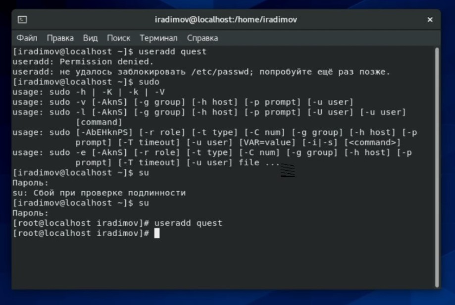
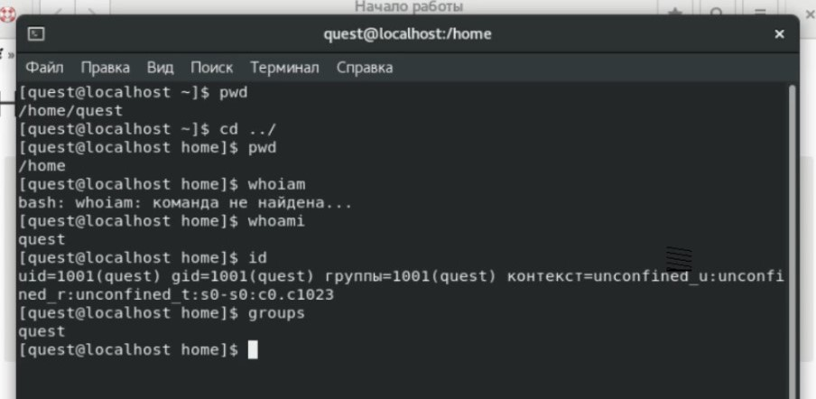
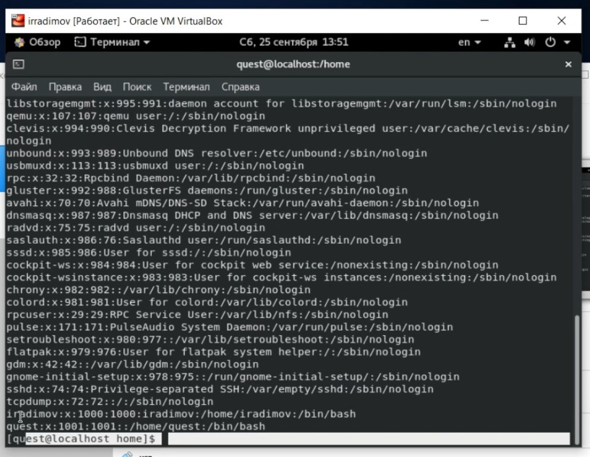
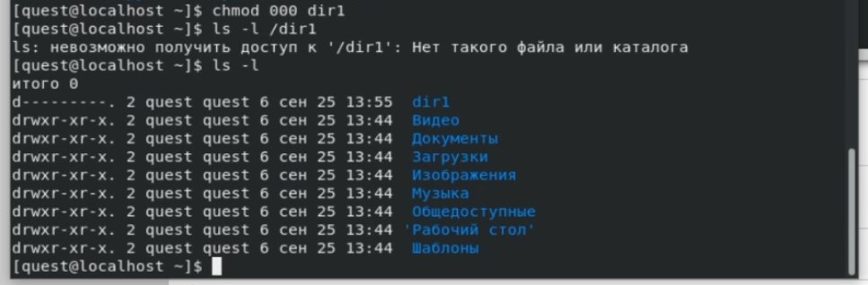
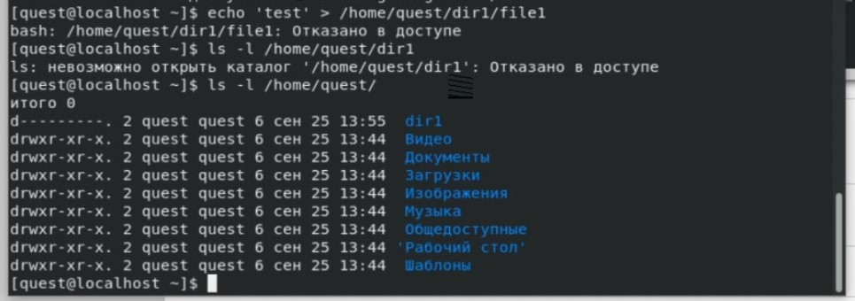

---
# Front matter
lang: ru-RU
title: 'Отчёт'
subtitle: 'по лабораторной работе 2'
author: 'Радимов Игорь Ринадович'

## Formatting
toc: false
slide_level: 2
theme: metropolis
mainfont: Ubuntu
romanfont: Ubuntu
sansfont: Ubuntu
monofont: Ubuntu
header-includes:
  - \metroset{progressbar=frametitle,sectionpage=progressbar,numbering=fraction}
  - '\makeatletter'
  - '\beamer@ignorenonframefalse'
  - '\makeatother'
aspectratio: 43
section-titles: true
---

## Цель работы

Получение практических навыков работы в консоли с атрибутами файлов, закрепление теоретических основ дискреционного разграничения доступа в современных системах с открытым кодом на базе ОС Linux.

## Задание

Необходимо изучить основы дискреционного разграничения доступа в современных системах с открытым кодом на базе ОС Linux на практике. Также нужно заполнить таблицу прав доступа.

## Выполнение лабораторной работы

1. Была создана новая учетная запись от имени администратора (рис.1). После чего был задан пароль на нового пользователя quest. Далее я вошел в систему под этим пользователем.

   { #fig:001 width=70% }

---

2. Была определена текущая директория, проверен текущий пользователь, его группа, группы в которые он входит (рис.2).

   { #fig:002 width=60% }

---

3. В файле /etc/passwd была найден текущий пользователь quest, uid и gid совпадают с найденными ранее (рис.3).

   { #fig:003 width=70% }

---

4. Были определены существующие поддиректоририи и проверены расширенные аттрибуты, установленные на поддиректориях (рис.4).

   { #fig:004 width=70% }

---

5. В домашней директории была создана поддиретория dir1, сняты все аттрибуты. С помощью команды chmod 000 dir1 снимаем все аттрибуты dir1, проверяем. Имеем права 000.(рис.5-6).

{ #fig:005 width=70% }

---

{ #fig:012 width=70% }

---

6. Далее путем последовательного выполнения команд (chmod,touch,rm,echo,mv,cat,ls,cd) для проверки прав доступа для директории и файла заполняем таблицу.

| Пр. дир. | Пр. фла | Созд. фла | Уд. фла | Зап. в фл | Чт. фла | См. дир. | Пр. флов в дир. | Переим. фла | См. атр. фла |
| :------------------ | :---------: | :--------------: | :--------------- | :-----------: | :------------: | :----------------- | :--------------------------: | :--------------------: | --------------------: |
| d(000)              |    (000)    |        -         | -                |       -       |       -        | -                  |              -               |           -            |                     - |
| d(100)              |    (000)    |        -         | -                |       -       |       -        | +                  |              -               |           -            |                     - |
| d(200)              |    (000)    |        -         | -                |       -       |       -        | -                  |              -               |           -            |                     - |
| d(300)              |    (000)    |        +         | +                |       -       |       -        | +                  |              -               |           +            |                     - |
| d(400)              |    (000)    |        -         | -                |       -       |       -        | -                  |              +               |           -            |                     - |
| d(500)              |    (000)    |        -         | -                |       -       |       -        | +                  |              +               |           -            |                     - |
| d(600)              |    (000)    |        -         | -                |       -       |       -        | -                  |              +               |           -            |                     - |
| d(700)              |    (000)    |        +         | +                |       -       |       -        | +                  |              +               |           +            |                     - |
|                     |             |                  |                  |               |                |                    |                              |                        |                       |

---

| Пр. дир. | Пр. фла | Созд. фла | Уд. фла | Зап. в фл | Чт. фла | См. дир. | Пр. флов в дир. | Переим. фла | См. атр. фла |
| :------------------ | :---------: | :--------------: | :--------------- | :-----------: | :------------: | :----------------- | :--------------------------: | :--------------------: | --------------------: |
| d(000)              |    (100)    |        -         | -                |       -       |       -        | -                  |              -               |           -            |                     - |
| d(100)              |    (100)    |        -         | -                |       -       |       -        | +                  |              -               |           -            |                     - |
| d(200)              |    (100)    |        -         | -                |       -       |       -        | -                  |              -               |           -            |                     - |
| d(300)              |    (100)    |        +         | +                |       -       |       -        | +                  |              -               |           +            |                     - |
| d(400)              |    (100)    |        -         | -                |       -       |       -        | -                  |              +               |           -            |                     - |
| d(500)              |    (100)    |        -         | -                |       -       |       -        | +                  |              +               |           -            |                     - |
| d(600)              |    (100)    |        -         | -                |       -       |       -        | -                  |              +               |           -            |                     - |
| d(700)              |    (100)    |        +         | +                |       -       |       -        | +                  |              +               |           +            |                     - |
|                     |             |                  |                  |               |                |                    |                              |                        |                       |

---

| Пр. дир. | Пр. фла | Созд. фла | Уд. фла | Зап. в фл | Чт. фла | См. дир. | Пр. флов в дир. | Переим. фла | См. атр. фла |
| :------------------ | :---------: | :--------------: | :--------------- | :-----------: | :------------: | :----------------- | :--------------------------: | :--------------------: | --------------------: |
| d(000)              |    (200)    |        -         | -                |       -       |       -        | -                  |              -               |           -            |                     - |
| d(100)              |    (200)    |        -         | -                |       +       |       -        | +                  |              -               |           -            |                     - |
| d(200)              |    (200)    |        -         | -                |       -       |       -        | -                  |              -               |           -            |                     - |
| d(300)              |    (200)    |        +         | +                |       +       |       -        | +                  |              -               |           +            |                     - |
| d(400)              |    (200)    |        -         | -                |       -       |       -        | -                  |              +               |           -            |                     - |
| d(500)              |    (200)    |        -         | -                |       +       |       -        | +                  |              +               |           -            |                     - |
| d(600)              |    (200)    |        -         | -                |       -       |       -        | -                  |              +               |           -            |                     - |
| d(700)              |    (200)    |        +         | +                |       +       |       -        | +                  |              +               |           +            |                     - |
|                     |             |                  |                  |               |                |                    |                              |                        |                       |

---

| Пр. дир. | Пр. фла | Созд. фла | Уд. фла | Зап. в фл | Чт. фла | См. дир. | Пр. флов в дир. | Переим. фла | См. атр. фла |
| :------------------ | :---------: | :--------------: | :--------------- | :-----------: | :------------: | :----------------- | :--------------------------: | :--------------------: | --------------------: |
| d(000)              |    (300)    |        -         | -                |       -       |       -        | -                  |              -               |           -            |                     - |
| d(100)              |    (300)    |        -         | -                |       +       |       -        | +                  |              -               |           -            |                     - |
| d(200)              |    (300)    |        -         | -                |       -       |       -        | -                  |              -               |           -            |                     - |
| d(300)              |    (300)    |        +         | +                |       +       |       -        | +                  |              -               |           +            |                     - |
| d(400)              |    (300)    |        -         | -                |       -       |       -        | -                  |              +               |           -            |                     - |
| d(500)              |    (300)    |        -         | -                |       +       |       -        | +                  |              +               |           -            |                     - |
| d(600)              |    (300)    |        -         | -                |       -       |       -        | -                  |              +               |           -            |                     - |
| d(700)              |    (300)    |        +         | +                |       +       |       -        | +                  |              +               |           +            |                     - |
|                     |             |                  |                  |               |                |                    |                              |                        |                       |

---

| Пр. дир. | Пр. фла | Созд. фла | Уд. фла | Зап. в фл | Чт. фла | См. дир. | Пр. флов в дир. | Переим. фла | См. атр. фла |
| :------------------ | :---------: | :--------------: | :--------------- | :-----------: | :------------: | :----------------- | :--------------------------: | :--------------------: | --------------------: |
| d(000)              |    (400)    |        -         | -                |       -       |       -        | -                  |              -               |           -            |                     - |
| d(100)              |    (400)    |        -         | -                |       -       |       +        | +                  |              -               |           -            |                     + |
| d(200)              |    (400)    |        -         | -                |       -       |       -        | -                  |              -               |           -            |                     - |
| d(300)              |    (400)    |        +         | +                |       -       |       +        | +                  |              -               |           +            |                     + |
| d(400)              |    (400)    |        -         | -                |       -       |       -        | -                  |              +               |           -            |                     - |
| d(500)              |    (400)    |        -         | -                |       -       |       +        | +                  |              +               |           -            |                     + |
| d(600)              |    (400)    |        -         | -                |       -       |       -        | -                  |              +               |           -            |                     - |
| d(700)              |    (400)    |        +         | +                |       -       |       +        | +                  |              +               |           +            |                     + |
|                     |             |                  |                  |               |                |                    |                              |                        |                       |

---

| Пр. дир. | Пр. фла | Созд. фла | Уд. фла | Зап. в фл | Чт. фла | См. дир. | Пр. флов в дир. | Переим. фла | См. атр. фла |
| :------------------ | :---------: | :--------------: | :--------------- | :-----------: | :------------: | :----------------- | :--------------------------: | :--------------------: | --------------------: |
| d(000)              |    (500)    |        -         | -                |       -       |       -        | -                  |              -               |           -            |                     - |
| d(100)              |    (500)    |        -         | -                |       -       |       +        | +                  |              -               |           -            |                     + |
| d(200)              |    (500)    |        -         | -                |       -       |       -        | -                  |              -               |           -            |                     - |
| d(300)              |    (500)    |        +         | +                |       -       |       +        | +                  |              -               |           +            |                     + |
| d(400)              |    (500)    |        -         | -                |       -       |       -        | -                  |              +               |           -            |                     - |
| d(500)              |    (500)    |        -         | -                |       -       |       +        | +                  |              +               |           -            |                     + |
| d(600)              |    (500)    |        -         | -                |       -       |       -        | -                  |              +               |           -            |                     - |
| d(700)              |    (500)    |        +         | +                |       -       |       +        | +                  |              +               |           +            |                     + |
|                     |             |                  |                  |               |                |                    |                              |                        |                       |

---

| Пр. дир. | Пр. фла | Созд. фла | Уд. фла | Зап. в фл | Чт. фла | См. дир. | Пр. флов в дир. | Переим. фла | См. атр. фла |
| :------------------ | :---------: | :--------------: | :--------------- | :-----------: | :------------: | :----------------- | :--------------------------: | :--------------------: | --------------------: |
| d(000)              |    (600)    |        -         | -                |       -       |       -        | -                  |              -               |           -            |                     - |
| d(100)              |    (600)    |        -         | -                |       +       |       +        | +                  |              -               |           -            |                     + |
| d(200)              |    (600)    |        -         | -                |       -       |       -        | -                  |              -               |           -            |                     - |
| d(300)              |    (600)    |        +         | +                |       +       |       +        | +                  |              -               |           +            |                     + |
| d(400)              |    (600)    |        -         | -                |       -       |       -        | -                  |              +               |           -            |                     - |
| d(500)              |    (600)    |        -         | -                |       +       |       +        | +                  |              +               |           -            |                     + |
| d(600)              |    (600)    |        -         | -                |       -       |       -        | -                  |              +               |           -            |                     - |
| d(700)              |    (600)    |        +         | +                |       +       |       +        | +                  |              +               |           +            |                     + |
|                     |             |                  |                  |               |                |                    |                              |                        |                       |

---

| Пр. дир. | Пр. фла | Созд. фла | Уд. фла | Зап. в фл | Чт. фла | См. дир. | Пр. флов в дир. | Переим. фла | См. атр. фла |
| :------------------ | :---------: | :--------------: | :--------------- | :-----------: | :------------: | :----------------- | :--------------------------: | :--------------------: | --------------------: |
| d(000)              |    (700)    |        -         | -                |       -       |       -        | -                  |              -               |           -            |                     - |
| d(100)              |    (700)    |        -         | -                |       +       |       +        | +                  |              -               |           -            |                     + |
| d(200)              |    (700)    |        -         | -                |       -       |       -        | -                  |              -               |           -            |                     - |
| d(300)              |    (700)    |        +         | +                |       +       |       +        | +                  |              -               |           +            |                     + |
| d(400)              |    (700)    |        -         | -                |       -       |       -        | -                  |              +               |           -            |                     - |
| d(500)              |    (700)    |        -         | -                |       +       |       +        | +                  |              +               |           -            |                     + |
| d(600)              |    (700)    |        -         | -                |       -       |       -        | -                  |              +               |           -            |                     - |
| d(700)              |    (700)    |        +         | +                |       +       |       +        | +                  |              +               |           +            |                     + |

---

7. После анализа таблицы выше, составляем итоговую таблицу.

| Операция               | Мин. пр. на дир. | Мин. пр. на файл |
| :--------------------- | :----------------: | ------------: |
| Создание файла         |           300            |                000 |
| Удаление файла         |           300            |                000 |
| Чтение файла           |           100            |                400 |
| Запись в файл          |           300            |                200 |
| Переим. файла   |           300            |                000 |
| Созд. поддир. |           300            |                  - |
| Уд. поддир. |           300            |                  - |

## Выводы

Приобрел практические навыки работы в консоли с атрибутами файлов, закрепил теоретические основы дискреционного разграничения доступа в современных системах с открытым кодом на базе ОС Linux.
