---
# Front matter
lang: ru-RU
title: 'Отчёт'
subtitle: 'по лабораторной работе 2'
author: 'Радимов Игорь Ринадович'

# Formatting
toc-title: 'Содержание'
toc: true # Table of contents
toc_depth: 2
lof: true # List of figures
lot: true # List of tables
fontsize: 12pt
linestretch: 1.5
papersize: a4paper
documentclass: scrreprt
polyglossia-lang: russian
polyglossia-otherlangs: english
mainfont: Ubuntu
romanfont: Ubuntu
sansfont: Ubuntu
monofont: Ubuntu
mainfontoptions: Ligatures=TeX
romanfontoptions: Ligatures=TeX
sansfontoptions: Ligatures=TeX,Scale=MatchLowercase
monofontoptions: Scale=MatchLowercase
indent: true
pdf-engine: lualatex
header-includes:
  - \linepenalty=10 # the penalty added to the badness of each line within a paragraph (no associated penalty node) Increasing the value makes tex try to have fewer lines in the paragraph.
  - \interlinepenalty=0 # value of the penalty (node) added after each line of a paragraph.
  - \hyphenpenalty=50 # the penalty for line breaking at an automatically inserted hyphen
  - \exhyphenpenalty=50 # the penalty for line breaking at an explicit hyphen
  - \binoppenalty=700 # the penalty for breaking a line at a binary operator
  - \relpenalty=500 # the penalty for breaking a line at a relation
  - \clubpenalty=150 # extra penalty for breaking after first line of a paragraph
  - \widowpenalty=150 # extra penalty for breaking before last line of a paragraph
  - \displaywidowpenalty=50 # extra penalty for breaking before last line before a display math
  - \brokenpenalty=100 # extra penalty for page breaking after a hyphenated line
  - \predisplaypenalty=10000 # penalty for breaking before a display
  - \postdisplaypenalty=0 # penalty for breaking after a display
  - \floatingpenalty = 20000 # penalty for splitting an insertion (can only be split footnote in standard LaTeX)
  - \raggedbottom # or \flushbottom
  - \usepackage{float} # keep figures where there are in the text
  - \floatplacement{figure}{H} # keep figures where there are in the text
---

# Цель работы

Получение практических навыков работы в консоли с атрибутами файлов, закрепление теоретических основ дискреционного разграничения доступа в современных системах с открытым кодом на базе ОС Linux.

# Задание

Необходимо изучить основы дискреционного разграничения доступа в современных системах с открытым кодом на базе ОС Linux на практике. Также нужно заполнить таблицу прав доступа.

# Теория

Права доступа имеют всего 3 опции − чтение, запись и запуск на выполнение, устанавливаемые для владельца, группы и прочих пользователей (для папки запуск на выполнение означает просмотр содержимого − списка файлов и вложенных папок).

Права можно задавать либо буквами r (read), w (Write) и x (eXecute), либо в двоичной системе (точнее в восьмеричной с использованием цифр от 0 до 7, но на основе двоичной системы).

Праву на чтение (r) соответствует значение 4, записи (w) − 2 и выполнению/просмотру файлов (x) − 1. Комбинируя эти значения, можно получать разные права. Например: - 6 = (4 + 2) − чтение и запись - 5 = (4 + 1) − чтение и исполнение

Первыми задаются права доступа для владельца, затем для группы и в конце для всех прочих.

Обычно для документов и файлов данных устанавливаются права 644 или 664. Это означает, что владелец может читать и изменять файл (включая удаление), члены группы в первом случае только читать, а во втором изменять, а все прочие − только читать.

Для исполняемых файлов и папок обычно задаются права 755 или 775. Значения те же, что и в предыдущем абзаце плюс присутствует право на выполнение или просмотр списка вложенных объектов.

Если задавать права доступа буквами, то указываются нужные права в виде rwx, а то, что нужно пропустить, заменяется дефисом. То есть, 644 соответствует rw-r--r--, а 755 − rwxr-xr-x.

# Выполнение лабораторной работы

1. В установленной при выполнении предыдущей лабораторной работы
   операционной системе создал учётную запись пользователя quest (использую учётную запись root):(рис.1). Для перехода в учётную запись root использую команду su, лоя создания учетной записи командой useradd quest.

   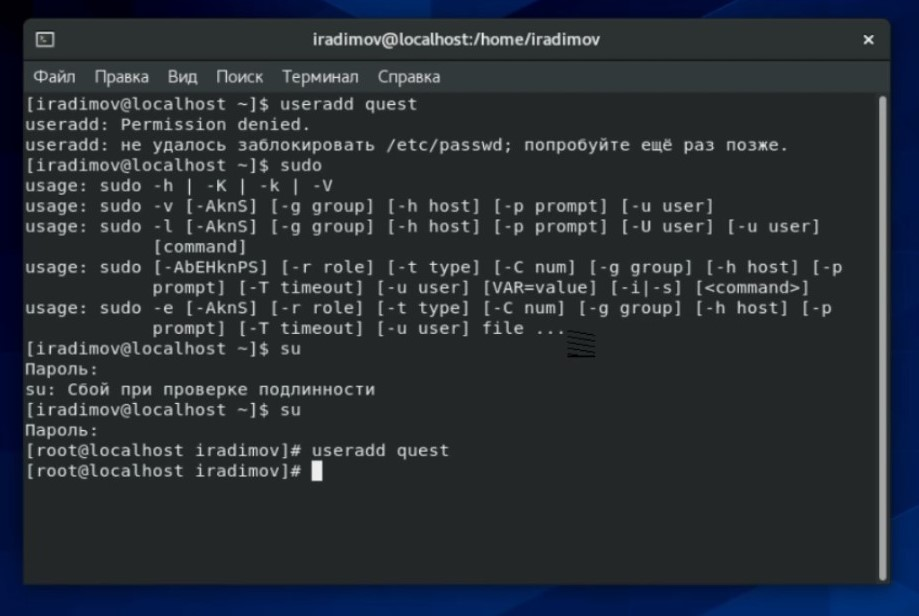{ #fig:001 width=70% }

2. Был задан пароль для пользователя quest, используя учётную запись root (рис.2).

   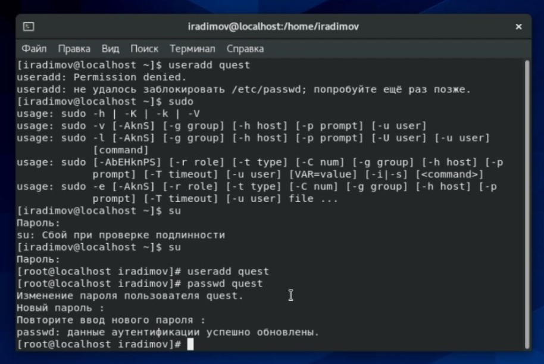{ #fig:002 width=70% }

3. Вошёл в систему от имени пользователя quest (рис.3).

   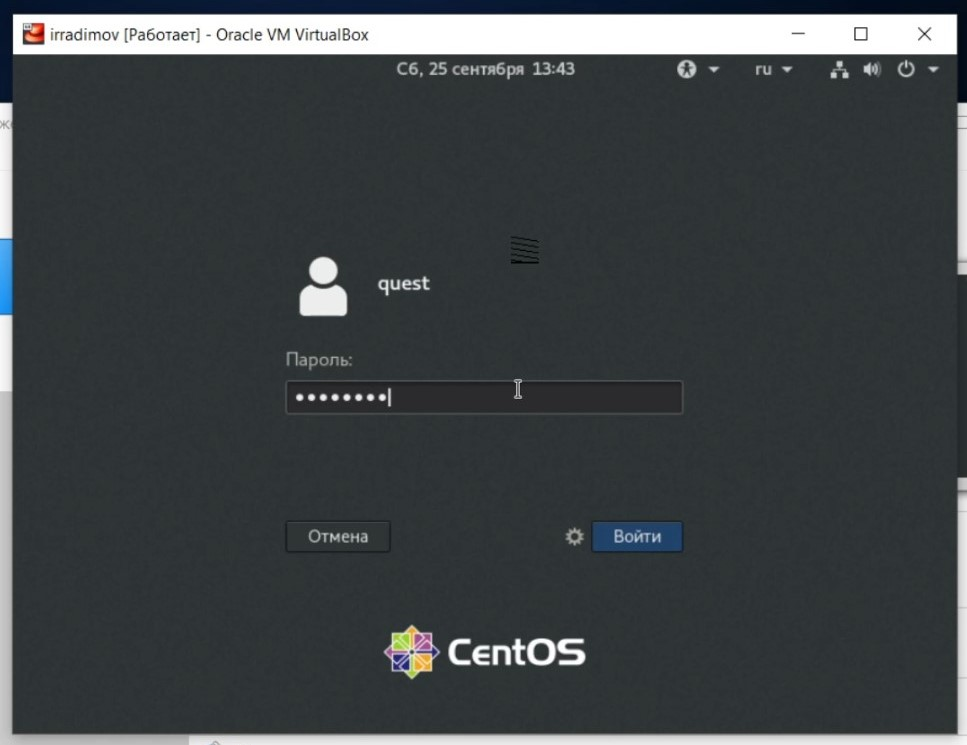{ #fig:003 width=70% }

4. Командой pwd была определена текущая директория. Действительно, мы находимся в домашней директории (рис.4). [quest@localhost ~]$ означает следующее: quest - имя учетной записи пользователя, localhost - имя компьютера, ~ - папка выполнения команды (домашняя).

   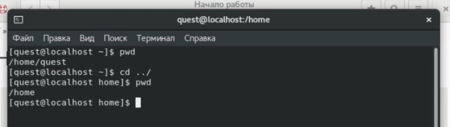{ #fig:004 width=70% }

5. Уточняю имя пользователя командой whoami (рис.5).

   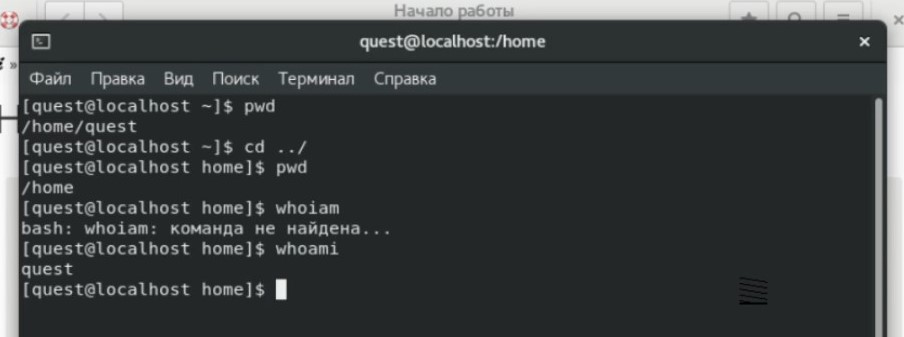{ #fig:005 width=70% }

6. При помощи команды id выясняем, имя пользователя quest, группа quest, uid=1001, gid=1001, входит только в группу 1001 (quest). Команда groups так же вывела одну группу guest (рис.6).

   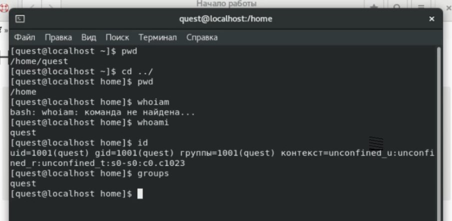{ #fig:006 width=70% }

7. Сравниваем полученную информацию об имени пользователя с данными, выводимыми в приглашении командной строки. Имя пользователя во всех командах выводится как quest, что совпадает с именем в приглашении командной строки.

8. В файле /etc/passwd нахожу свою учетную запись, всё совпадает с результатами выполнения команд, из предыдущих пунктов (рис.7).

   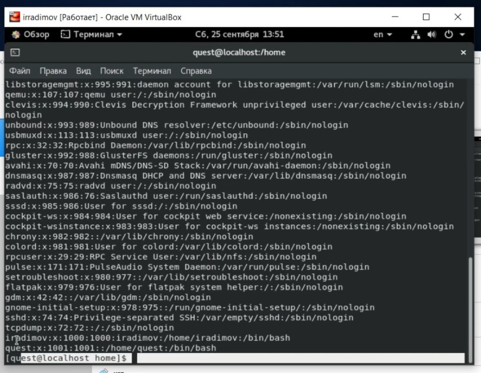{ #fig:007 width=70% }

9. Определил существующие в системе директории командой ls -l /home/. Получаем список поддиректорий директории /home. На директориях iradimov и quest установленны права 700 (рис.8).

   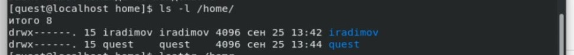{ #fig:008 width=70% }

10. С помощью команды lsattr /home пытаемся получить информацию о расширенных аттрибутах. Для пользователя iradimov имеем отказ в доступе, для quest получаем.(рис.9).

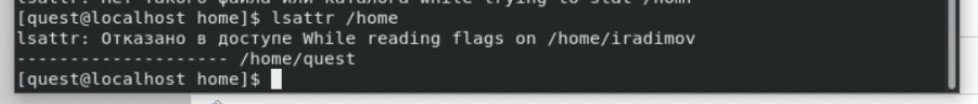{ #fig:009 width=70% }

11. С помощью команды mkdir dir1 создаем в домашней директории поддиректорию dir1.(рис.10).

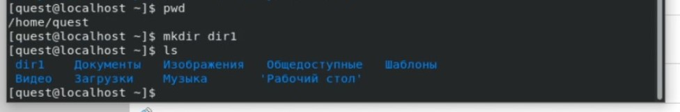{ #fig:010 width=70% }

12. С помощью команды chmod 000 dir1 снимаем все аттрибуты dir1, проверяем. Имеем права 000.(рис.11).

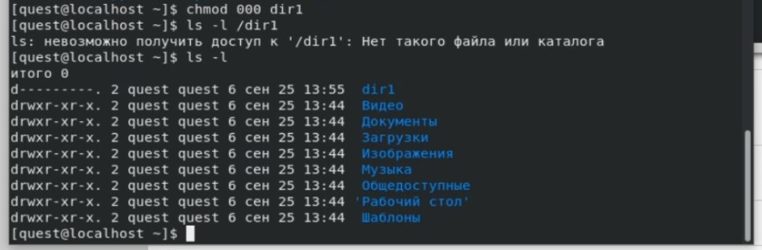{ #fig:011 width=70% }

13. Пытаемся создать в директории dir1 файл file1 командой echo "test" > /home/guest/dir1/file1, получаем отказ в доступе (рис.12).

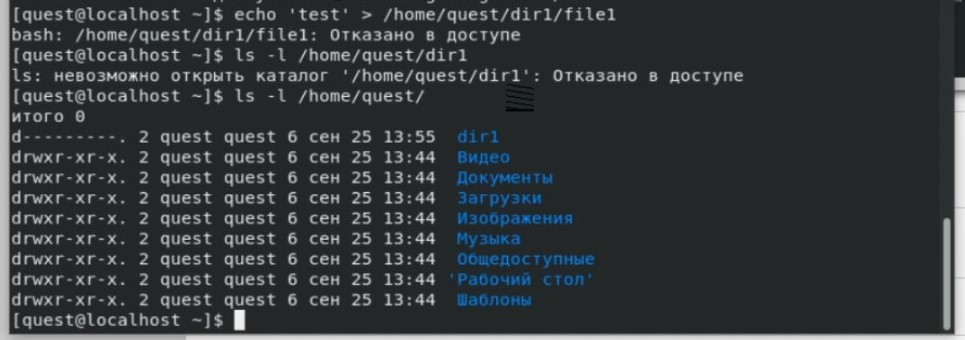{ #fig:012 width=70% }

14. Далее путем последовательного выполнения команд (chmod,touch,rm,echo,mv,cat,ls,cd) для проверки прав доступа для директории и файла заполняем таблицу.

| Правка дирек- тории | Права файла | Созда- ние файла | Удале- ние файла | Запись в файл | Чте- ние файла | Смена дирек- тории | Просмотр файлов в директории | Переиме- нование файла | Смена атрибутов файла |
| :------------------ | :---------: | :--------------: | :--------------- | :-----------: | :------------: | :----------------- | :--------------------------: | :--------------------: | --------------------: |
| d(000)              |    (000)    |        -         | -                |       -       |       -        | -                  |              -               |           -            |                     - |
| d(100)              |    (000)    |        -         | -                |       -       |       -        | +                  |              -               |           -            |                     - |
| d(200)              |    (000)    |        -         | -                |       -       |       -        | -                  |              -               |           -            |                     - |
| d(300)              |    (000)    |        +         | +                |       -       |       -        | +                  |              -               |           +            |                     - |
| d(400)              |    (000)    |        -         | -                |       -       |       -        | -                  |              +               |           -            |                     - |
| d(500)              |    (000)    |        -         | -                |       -       |       -        | +                  |              +               |           -            |                     - |
| d(600)              |    (000)    |        -         | -                |       -       |       -        | -                  |              +               |           -            |                     - |
| d(700)              |    (000)    |        +         | +                |       -       |       -        | +                  |              +               |           +            |                     - |
|                     |             |                  |                  |               |                |                    |                              |                        |                       |
| d(000)              |    (100)    |        -         | -                |       -       |       -        | -                  |              -               |           -            |                     - |
| d(100)              |    (100)    |        -         | -                |       -       |       -        | +                  |              -               |           -            |                     - |
| d(200)              |    (100)    |        -         | -                |       -       |       -        | -                  |              -               |           -            |                     - |
| d(300)              |    (100)    |        +         | +                |       -       |       -        | +                  |              -               |           +            |                     - |
| d(400)              |    (100)    |        -         | -                |       -       |       -        | -                  |              +               |           -            |                     - |
| d(500)              |    (100)    |        -         | -                |       -       |       -        | +                  |              +               |           -            |                     - |
| d(600)              |    (100)    |        -         | -                |       -       |       -        | -                  |              +               |           -            |                     - |
| d(700)              |    (100)    |        +         | +                |       -       |       -        | +                  |              +               |           +            |                     - |
|                     |             |                  |                  |               |                |                    |                              |                        |                       |
| d(000)              |    (200)    |        -         | -                |       -       |       -        | -                  |              -               |           -            |                     - |
| d(100)              |    (200)    |        -         | -                |       +       |       -        | +                  |              -               |           -            |                     - |
| d(200)              |    (200)    |        -         | -                |       -       |       -        | -                  |              -               |           -            |                     - |
| d(300)              |    (200)    |        +         | +                |       +       |       -        | +                  |              -               |           +            |                     - |
| d(400)              |    (200)    |        -         | -                |       -       |       -        | -                  |              +               |           -            |                     - |
| d(500)              |    (200)    |        -         | -                |       +       |       -        | +                  |              +               |           -            |                     - |
| d(600)              |    (200)    |        -         | -                |       -       |       -        | -                  |              +               |           -            |                     - |
| d(700)              |    (200)    |        +         | +                |       +       |       -        | +                  |              +               |           +            |                     - |
|                     |             |                  |                  |               |                |                    |                              |                        |                       |
| d(000)              |    (300)    |        -         | -                |       -       |       -        | -                  |              -               |           -            |                     - |
| d(100)              |    (300)    |        -         | -                |       +       |       -        | +                  |              -               |           -            |                     - |
| d(200)              |    (300)    |        -         | -                |       -       |       -        | -                  |              -               |           -            |                     - |
| d(300)              |    (300)    |        +         | +                |       +       |       -        | +                  |              -               |           +            |                     - |
| d(400)              |    (300)    |        -         | -                |       -       |       -        | -                  |              +               |           -            |                     - |
| d(500)              |    (300)    |        -         | -                |       +       |       -        | +                  |              +               |           -            |                     - |
| d(600)              |    (300)    |        -         | -                |       -       |       -        | -                  |              +               |           -            |                     - |
| d(700)              |    (300)    |        +         | +                |       +       |       -        | +                  |              +               |           +            |                     - |
|                     |             |                  |                  |               |                |                    |                              |                        |                       |
| d(000)              |    (400)    |        -         | -                |       -       |       -        | -                  |              -               |           -            |                     - |
| d(100)              |    (400)    |        -         | -                |       -       |       +        | +                  |              -               |           -            |                     + |
| d(200)              |    (400)    |        -         | -                |       -       |       -        | -                  |              -               |           -            |                     - |
| d(300)              |    (400)    |        +         | +                |       -       |       +        | +                  |              -               |           +            |                     + |
| d(400)              |    (400)    |        -         | -                |       -       |       -        | -                  |              +               |           -            |                     - |
| d(500)              |    (400)    |        -         | -                |       -       |       +        | +                  |              +               |           -            |                     + |
| d(600)              |    (400)    |        -         | -                |       -       |       -        | -                  |              +               |           -            |                     - |
| d(700)              |    (400)    |        +         | +                |       -       |       +        | +                  |              +               |           +            |                     + |
|                     |             |                  |                  |               |                |                    |                              |                        |                       |
| d(000)              |    (500)    |        -         | -                |       -       |       -        | -                  |              -               |           -            |                     - |
| d(100)              |    (500)    |        -         | -                |       -       |       +        | +                  |              -               |           -            |                     + |
| d(200)              |    (500)    |        -         | -                |       -       |       -        | -                  |              -               |           -            |                     - |
| d(300)              |    (500)    |        +         | +                |       -       |       +        | +                  |              -               |           +            |                     + |
| d(400)              |    (500)    |        -         | -                |       -       |       -        | -                  |              +               |           -            |                     - |
| d(500)              |    (500)    |        -         | -                |       -       |       +        | +                  |              +               |           -            |                     + |
| d(600)              |    (500)    |        -         | -                |       -       |       -        | -                  |              +               |           -            |                     - |
| d(700)              |    (500)    |        +         | +                |       -       |       +        | +                  |              +               |           +            |                     + |
|                     |             |                  |                  |               |                |                    |                              |                        |                       |
| d(000)              |    (600)    |        -         | -                |       -       |       -        | -                  |              -               |           -            |                     - |
| d(100)              |    (600)    |        -         | -                |       +       |       +        | +                  |              -               |           -            |                     + |
| d(200)              |    (600)    |        -         | -                |       -       |       -        | -                  |              -               |           -            |                     - |
| d(300)              |    (600)    |        +         | +                |       +       |       +        | +                  |              -               |           +            |                     + |
| d(400)              |    (600)    |        -         | -                |       -       |       -        | -                  |              +               |           -            |                     - |
| d(500)              |    (600)    |        -         | -                |       +       |       +        | +                  |              +               |           -            |                     + |
| d(600)              |    (600)    |        -         | -                |       -       |       -        | -                  |              +               |           -            |                     - |
| d(700)              |    (600)    |        +         | +                |       +       |       +        | +                  |              +               |           +            |                     + |
|                     |             |                  |                  |               |                |                    |                              |                        |                       |
| d(000)              |    (700)    |        -         | -                |       -       |       -        | -                  |              -               |           -            |                     - |
| d(100)              |    (700)    |        -         | -                |       +       |       +        | +                  |              -               |           -            |                     + |
| d(200)              |    (700)    |        -         | -                |       -       |       -        | -                  |              -               |           -            |                     - |
| d(300)              |    (700)    |        +         | +                |       +       |       +        | +                  |              -               |           +            |                     + |
| d(400)              |    (700)    |        -         | -                |       -       |       -        | -                  |              +               |           -            |                     - |
| d(500)              |    (700)    |        -         | -                |       +       |       +        | +                  |              +               |           -            |                     + |
| d(600)              |    (700)    |        -         | -                |       -       |       -        | -                  |              +               |           -            |                     - |
| d(700)              |    (700)    |        +         | +                |       +       |       +        | +                  |              +               |           +            |                     + |

15. После анадиза таблицы выше, составляем итоговую таблицу.

| Операция               | Мин. права на директорию | Мин. права на файл |
| :--------------------- | :----------------------: | -----------------: |
| Создание файла         |           300            |                000 |
| Удаление файла         |           300            |                000 |
| Чтение файла           |           100            |                400 |
| Запись в файл          |           300            |                200 |
| Переименование файла   |           300            |                000 |
| Создание поддиректории |           300            |                  - |
| Удаление поддиректории |           300            |                  - |

# Библиография

1. ТУИС РУДН

# Выводы

Приобрел практические навыки работы в консоли с атрибутами файлов, закрепил теоретические основы дискреционного разграничения доступа в современных системах с открытым кодом на базе ОС Linux.
