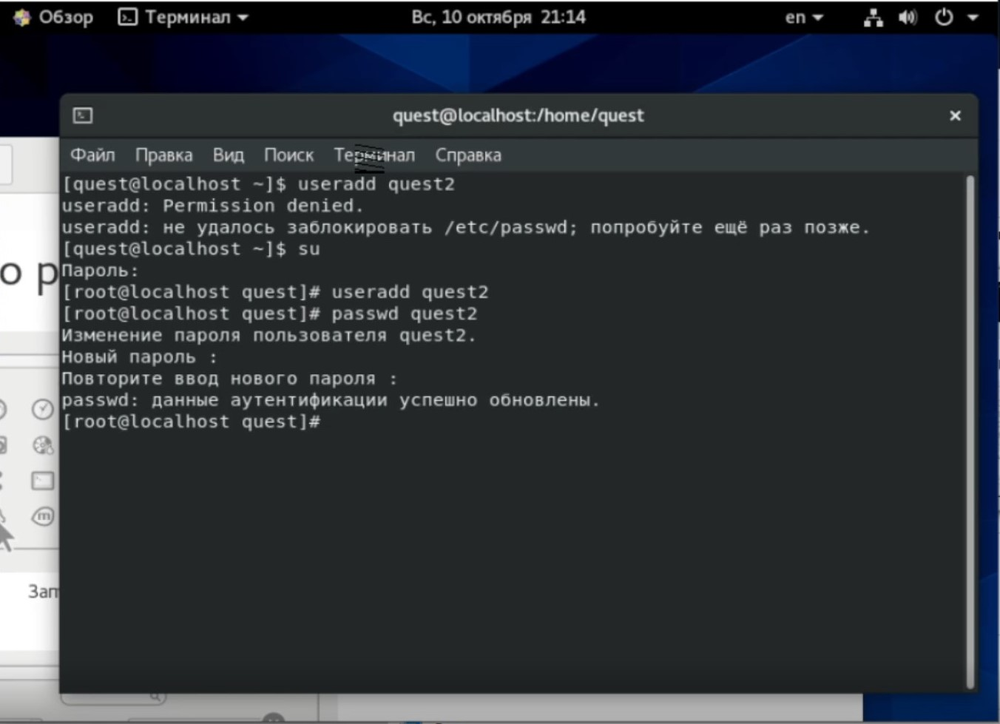
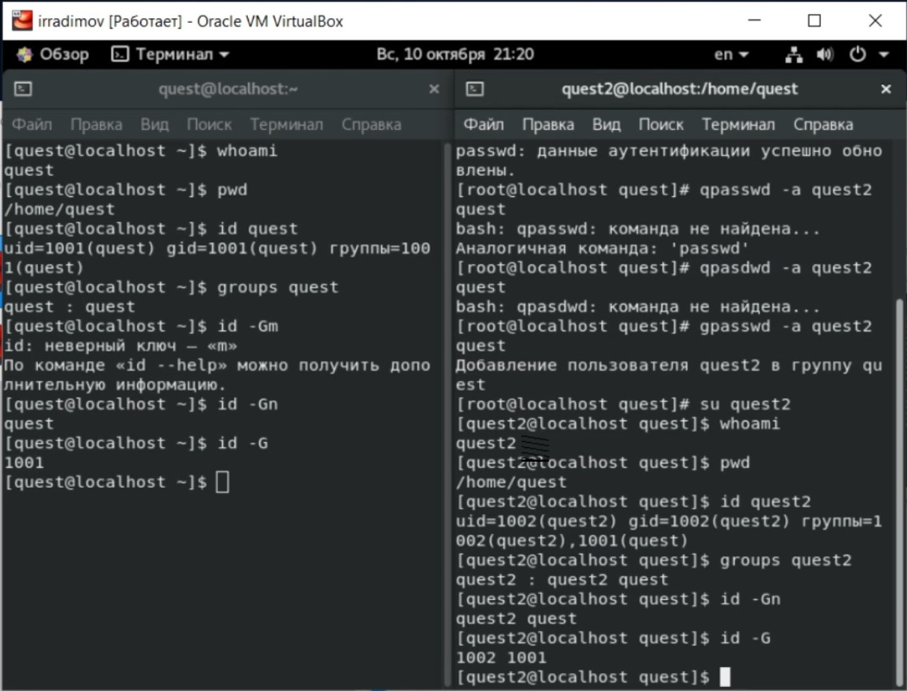
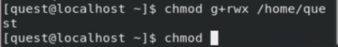
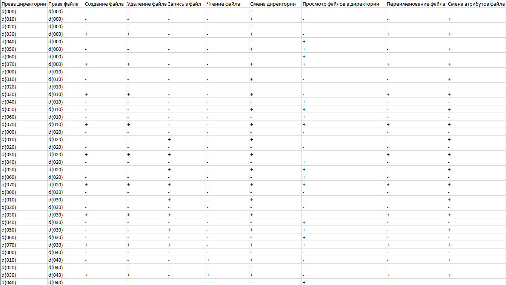
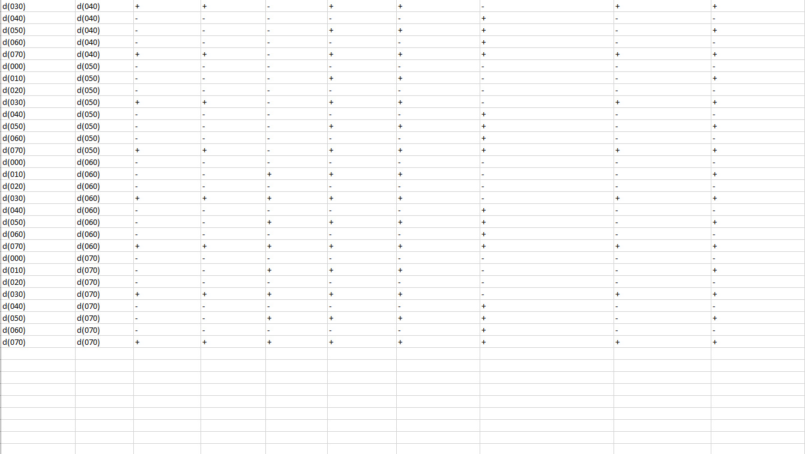

---
# Front matter
lang: ru-RU
title: 'Отчёт'
subtitle: 'по лабораторной работе 3'
author: 'Радимов Игорь Ринадович'

## Formatting
toc: false
slide_level: 2
theme: metropolis
mainfont: Ubuntu
romanfont: Ubuntu
sansfont: Ubuntu
monofont: Ubuntu
header-includes:
  - \metroset{progressbar=frametitle,sectionpage=progressbar,numbering=fraction}
  - '\makeatletter'
  - '\beamer@ignorenonframefalse'
  - '\makeatother'
aspectratio: 43
section-titles: true
---

## Цель работы

Получение практических навыков работы в консоли с атрибутами файлов для групп пользователей.

## Задание

Лабораторная работа подразумевает использование некоторых консольных команд для взаимодействия с директориями и файлами, а также составление таблицы установленных прав и разрешённых действий.

# Выполнение лабораторной работы

1. Открываю Oracle VirtualBox и включаю виртуальную машину Base. Создаю нового пользователя quest2.

{ #fig:001 width=70% }

---

2. Далее я использую некоторые команды, такие как pwd, id , groups.

{ #fig:002 width=70% }

---

3. Далее применяю команду chmod.

{ #fig:003 width=70% }

---

4. Заполняю таблицу «Установленные права и разрешённые действия», выполняя действия от имени владельца директории (файлов), определив опытным путём, какие операции разрешены, а какие нет. Если операция разрешена, занешу в таблицу знак «+», если не разрешена, знак «-».

{ #fig:004 width=70% }

---

5. Продолжение таблицы.

{ #fig:005 width=70% }

---

6. На основании заполненной таблицы определяю те или иные минимально необходимые права для выполнения операций внутри директории dir1, заполняю таблицу.

{ #fig:006 width=70% }

---

## {.standout}

Спасибо за внимание
