---
# Front matter
lang: ru-RU
title: 'Отчёт'
subtitle: 'по лабораторной работе 3'
author: 'Радимов Игорь Ринадович'

# Formatting
toc-title: 'Содержание'
toc: true # Table of contents
toc_depth: 2
lof: true # List of figures
lot: true # List of tables
fontsize: 12pt
linestretch: 1.5
papersize: a4paper
documentclass: scrreprt
polyglossia-lang: russian
polyglossia-otherlangs: english
mainfont: Ubuntu
romanfont: Ubuntu
sansfont: Ubuntu
monofont: Ubuntu
mainfontoptions: Ligatures=TeX
romanfontoptions: Ligatures=TeX
sansfontoptions: Ligatures=TeX,Scale=MatchLowercase
monofontoptions: Scale=MatchLowercase
indent: true
pdf-engine: lualatex
header-includes:
  - \linepenalty=10 # the penalty added to the badness of each line within a paragraph (no associated penalty node) Increasing the value makes tex try to have fewer lines in the paragraph.
  - \interlinepenalty=0 # value of the penalty (node) added after each line of a paragraph.
  - \hyphenpenalty=50 # the penalty for line breaking at an automatically inserted hyphen
  - \exhyphenpenalty=50 # the penalty for line breaking at an explicit hyphen
  - \binoppenalty=700 # the penalty for breaking a line at a binary operator
  - \relpenalty=500 # the penalty for breaking a line at a relation
  - \clubpenalty=150 # extra penalty for breaking after first line of a paragraph
  - \widowpenalty=150 # extra penalty for breaking before last line of a paragraph
  - \displaywidowpenalty=50 # extra penalty for breaking before last line before a display math
  - \brokenpenalty=100 # extra penalty for page breaking after a hyphenated line
  - \predisplaypenalty=10000 # penalty for breaking before a display
  - \postdisplaypenalty=0 # penalty for breaking after a display
  - \floatingpenalty = 20000 # penalty for splitting an insertion (can only be split footnote in standard LaTeX)
  - \raggedbottom # or \flushbottom
  - \usepackage{float} # keep figures where there are in the text
  - \floatplacement{figure}{H} # keep figures where there are in the text
---

# Цель работы

Получение практических навыков работы в консоли с атрибутами файлов для групп пользователей.

# Задание

Лабораторная работа подразумевает использование некоторых консольных команд для взаимодействия с директориями и файлами, а также составление таблицы установленных прав и разрешённых действий.

# Теория

Команда chmod предназначена для изменения прав доступа файлов и директорий в Linux. Название команды произошло от словосочетания «change mode».

Синтаксис команды chmod следующий: chmod разрешения имя_файла.

Пример: chmod 555 file1.

В данном формате права доступа задаются не символами rwx, как описано выше, а трехзначным числом. Каждая цифра числа означает определенный набор прав доступа.

Первая цифра используется для указания прав доступа для пользователя. Вторая цифра для группы. Третья для всех остальных.

# Выполнение работы

1. При выполнении предыдущей лабораторной работы уже был создан пользователь quest.

2. Создаём учетную запись quest2.(рис.1)

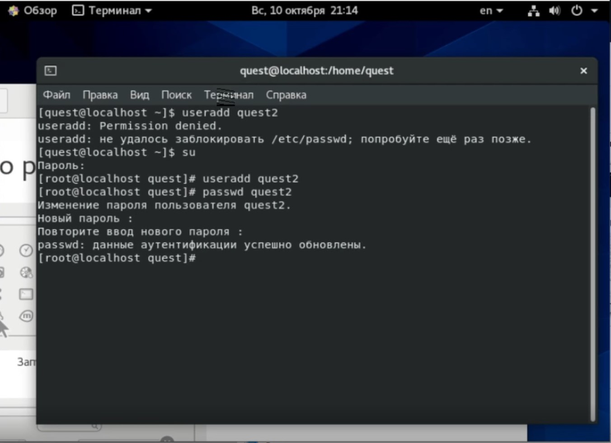{ #fig:001 width=90% }

3. Добавляем пользователя quest2 в группу quest.(рис.2)

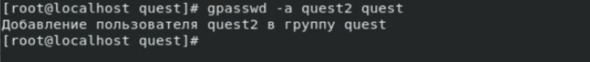{ #fig:002 width=90% }

4. Осуществляем вход с двух пользователей сразу. Командой pwd определяем директорию. Как видно, название сходится с приглашением консоли. ( рис.3)

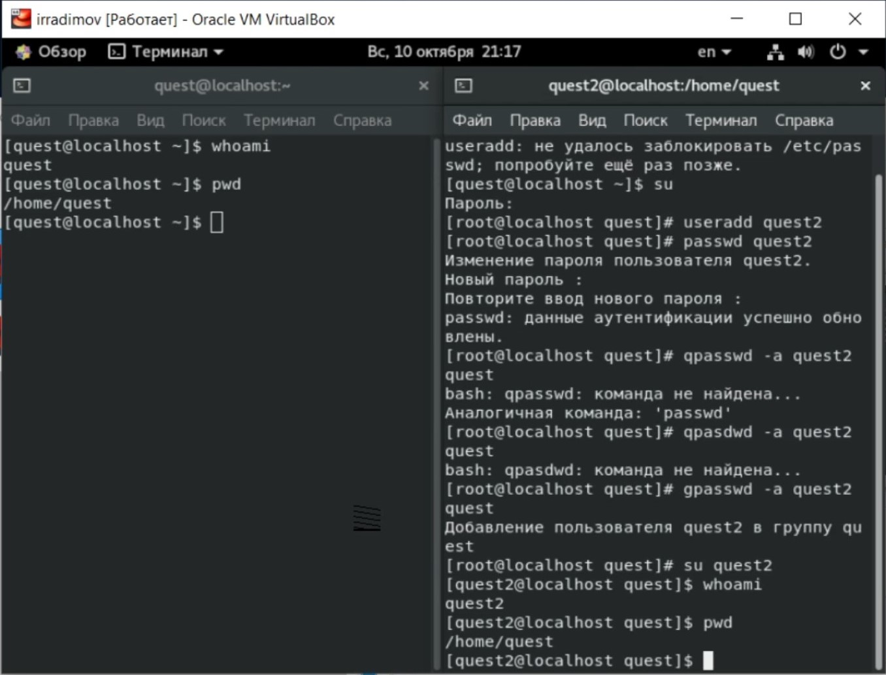{ #fig:003 width=90% }

5. Уточняю имя моего пользователя, его группу, а также группы, куда входит пользователь.Определяю командами
   groups quest и groups quest2, в какие группы входят пользователи quest и quest2. Сравниваю вывод команды groups с выводом команд id -Gn и id -G. (рис. 4)

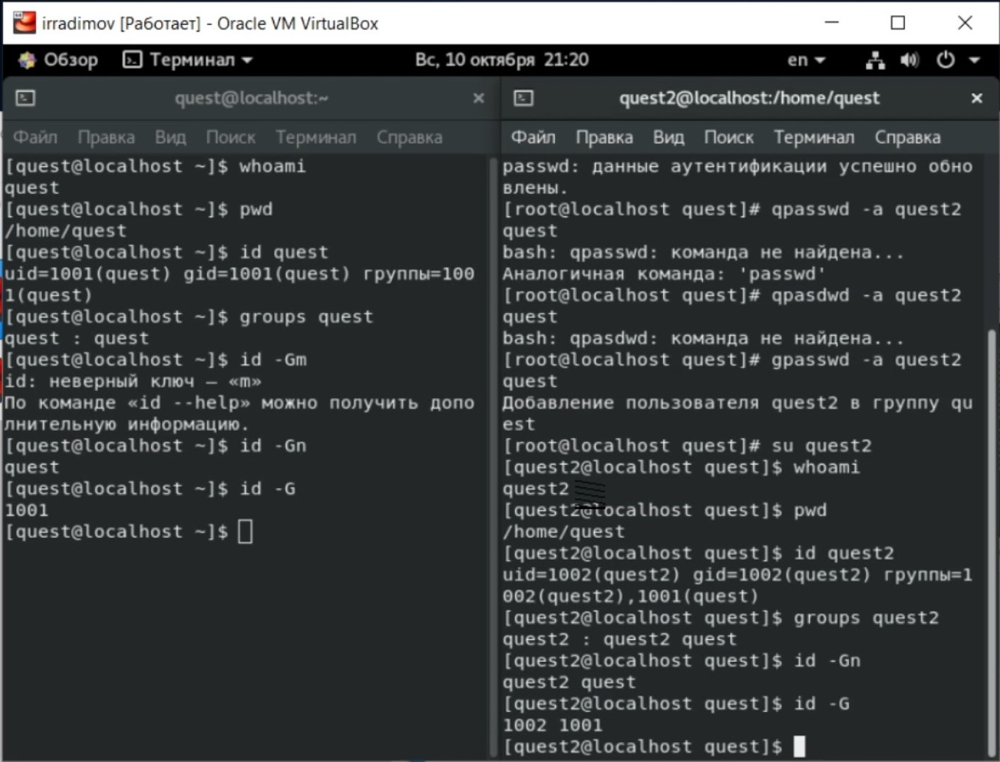{ #fig:004 width=90% }

6. Cравниваю полученную информацию с файлом /etc/passwd командой cat /etc/passwd. Данные сходится.(рис. 5)

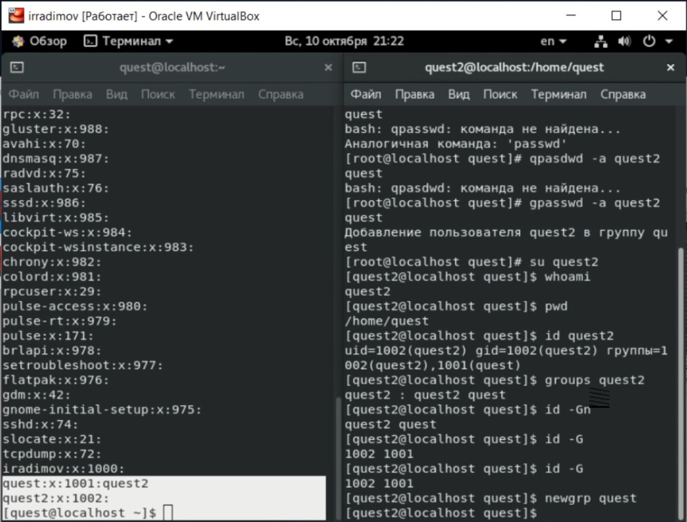{ #fig:005 width=90% }

7. От имени пользователя quest2 выполняю регистрацию пользователя quest2 в группе quest.(рис. 6).

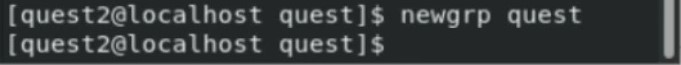{ #fig:006 width=90% }

8. От имени пользователя quest изменяю права директории /home/quest, разрешив все действия для пользователей группы.(рис. 7).

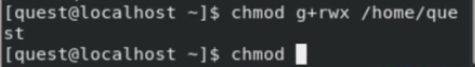{ #fig:007 width=90% }

9. От имени пользователя quest снимаю права с директории /home/quest/dir1 все атрибуты командой chmod 000 dirl. (рис. 8)

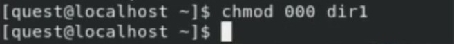{ #fig:008 width=90% }

12. Заполняю таблицу «Установленные права и разрешённые действия», выполняя действия от имени владельца директории (файлов), определив опытным путём, какие операции разрешены, а какие нет.
    Если операция разрешена, заношу в таблицу знак «+», если не разрешена, знак «-».

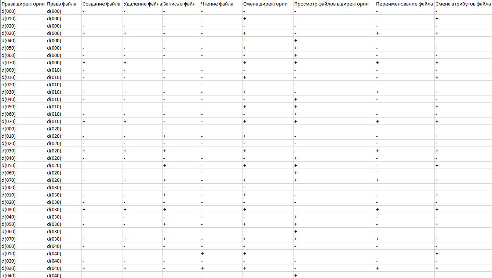{ #fig:009 width=90% }

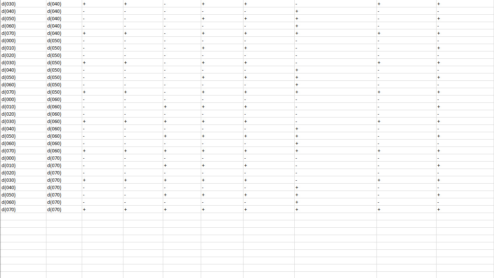{ #fig:010 width=90% }

13. На основании заполненной таблицы заполняю вторую таблицу минимальных прав для совершения операций от имени пользователей входящих в группу.

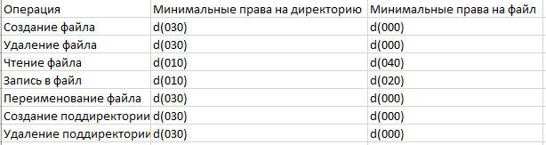{ #fig:011 width=90% }

# Библиография

1. ТУИС РУДН

# Выводы

Во время выполнения лабораторной работы я получил практические навыки работы в консоли с атрибутами файлов для групп пользователей.
