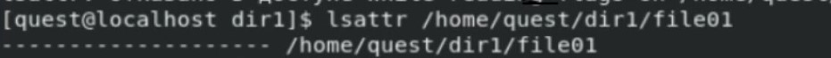
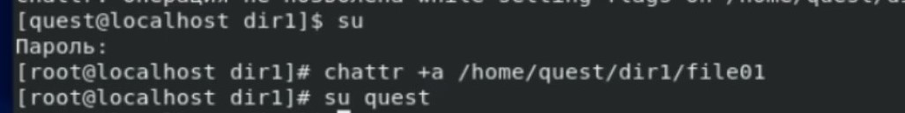
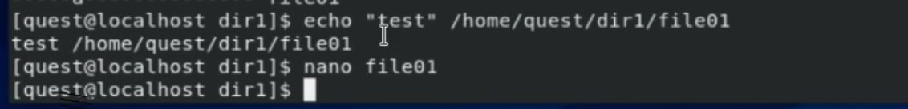
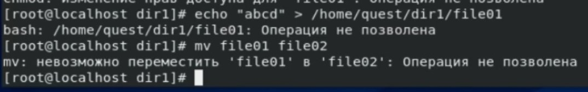
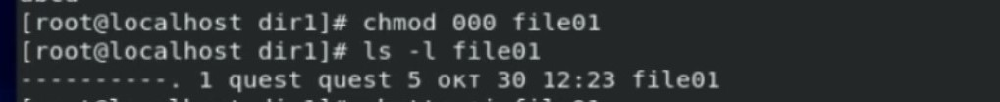
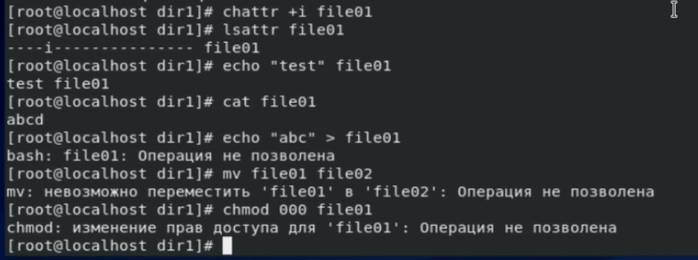

---
## Front matter
lang: ru-RU
title: Отчёт по лабораторной работе 4
author: 'Радимов Игорь'
date: 30 октября, 2021

## Formatting
toc: false
slide_level: 2
theme: metropolis
mainfont: Ubuntu
romanfont: Ubuntu
sansfont: Ubuntu
monofont: Ubuntu
header-includes:
  - \metroset{progressbar=frametitle,sectionpage=progressbar,numbering=fraction}
  - '\makeatletter'
  - '\beamer@ignorenonframefalse'
  - '\makeatother'
aspectratio: 43
section-titles: true
---

## Цель работы

Получение практических навыков работы в консоли с расширенными атрибутами файлов.

# Задание

При помощи консольных команд для редактирования расширенных аттрибутов произвести взаимодействие с директориями и файлами.

# Выполнение лабораторной работы

1. От имени пользователя quest определяю расширенные атрибуты файла file01.(рис 1)

{ #fig:001 width=90% }

---

2. Далее я использую команду chattr чтобы присвоить атрибут а файлу file01 .

{ #fig:002 width=70% }

---

3. Далее я вставляю слово test в file01.

{ #fig:003 width=70% }

---

4. Пробую перезаписать file01 и снова изменить права доступа к файлу file01.

{ #fig:004 width=70% }

---

5. Убираю атрибут а, проверяю права.

{ #fig:005 width=70% }

---

6. Добавляю атрибут i и делаю все действия заново.

{ #fig:006 width=70% }

---

## {.standout}

Спасибо за внимание
