---
## Front matter
lang: ru-RU
title: Отчёт по лабораторной работе 5
author: 'Радимов Игорь'

## Formatting
toc: false
slide_level: 2
theme: metropolis
mainfont: Ubuntu
romanfont: Ubuntu
sansfont: Ubuntu
monofont: Ubuntu
header-includes:
  - \metroset{progressbar=frametitle,sectionpage=progressbar,numbering=fraction}
  - '\makeatletter'
  - '\beamer@ignorenonframefalse'
  - '\makeatother'
aspectratio: 43
section-titles: true
---

# Цель работы

Изучение механизмов изменения идентификаторов, применения SetUID- и Sticky-битов. Получение практических навыков работы в консоли с дополнительными атрибутами. Рассмотрение работы механизма смены идентификатора процессов пользователей, а также влияние бита Sticky на запись и удаление файлов.

# Задание

Лабораторная работа подразумевает изучение влияния дополнительных атрибутов на файлы пользователя и изучение механизмов изменения идентификаторов.

## Выполнение основной частии лабораторной работы

1. Создал программу simpleid.c (рис. 1).

   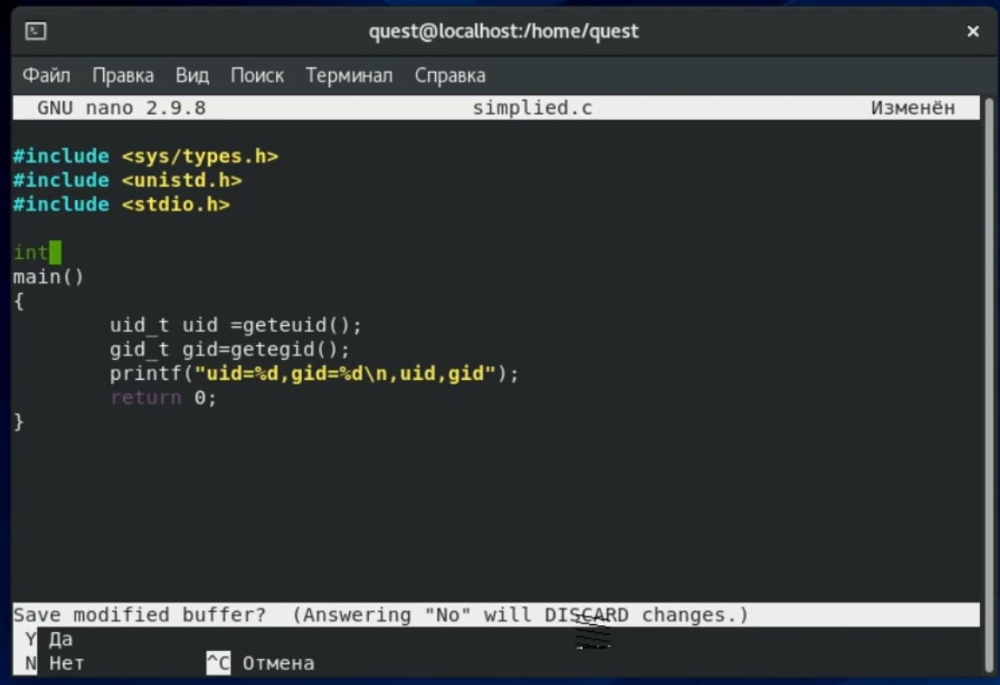{ #fig:001 width=60% }

---

2. Выполнил системную программу id и сравнил полученный результат с данными предыдущего пункта задания (рис. 2). Видим, что пользователи и группы совпадают. При этом команда id вывела действительные идентификаторы, а программа вывел эффективные, но при этом они совпадают и выводят 1001, то есть пользователя quest.

   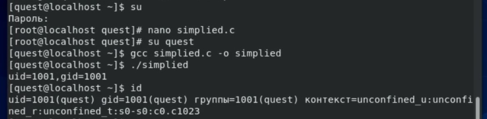{ #fig:002 width=60% }

---

3. Усложнил программу, добавив вывод действительных идентификаторов, получившуюся программу назвал simpleid2.c (рис. 3).

   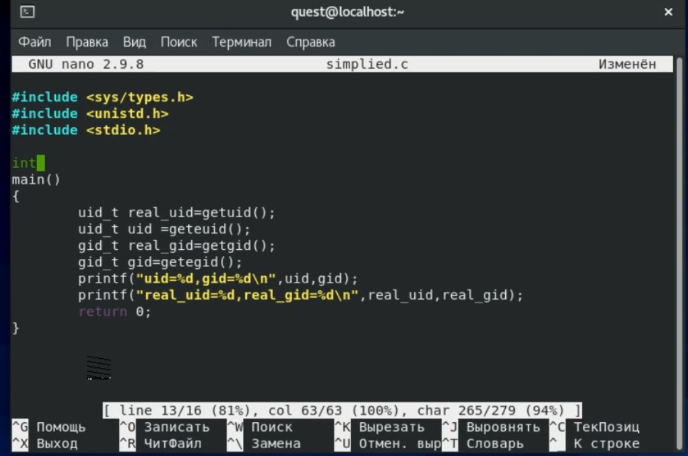{ #fig:003 width=60% }

---

4. Запустил simpleid2 и id командами ./simpleid2 и id (рис. 4). Сравнил результаты: действительные идентификаторы совпадают с выводом команды id - везде 0, то есть рут-пользователь. Так же важно заметить, что эффективные идентификаторы совпадают с действительными.

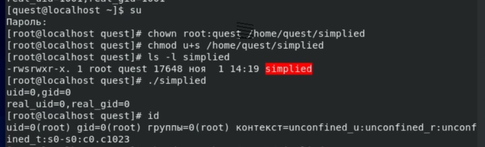{ #fig:004 width=60% }

---

5. Проделал тоже самое относительно SetGID-бита (рис. 5)

Установка SetGID-бита отражается к команде ls, а сравнение выполнения программы и команды id дало следующие результаты: действительные идентификаторы совпадают с выводом команды id - везде 0, то есть рут-пользователь. Но так же важно заметить, что эффективные идентификаторы отличны от действительных: пользователь - 0, группа - 1001.

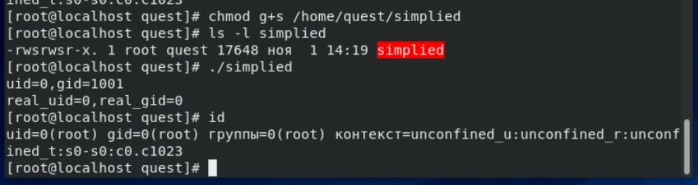{ #fig:005 width=60% }

---

6. Создал программу readfile.c (рис. 6).

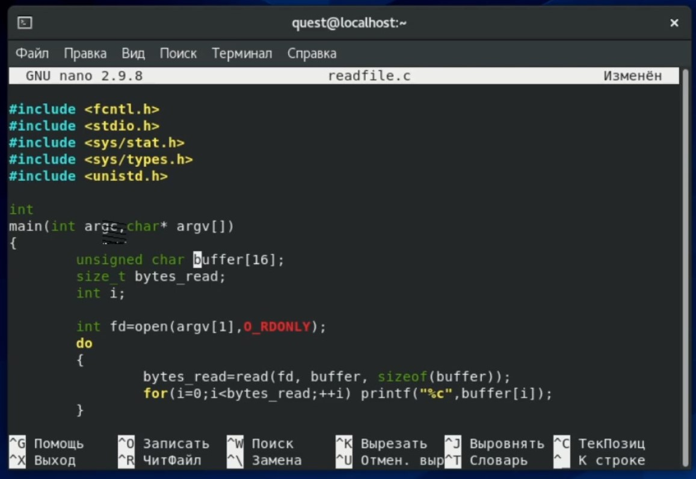{ #fig:006 width=60% }

---

7. Проверил, может ли программа readfile прочитать файл readfile.c. Да, может (рис. 7).

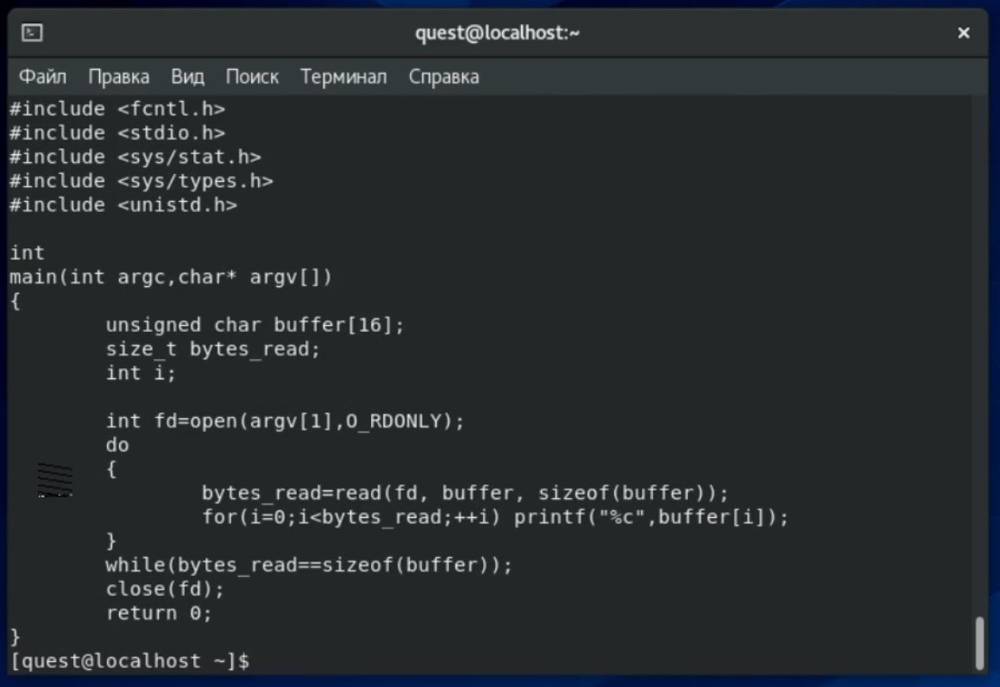{ #fig:007 width=60% }

---

8. Проверил, может ли программа readfile прочитать файл /etc/shadow. Её выполненеи возможно в том числе, так как владельцем файла является root-пользователь (рис. 8).

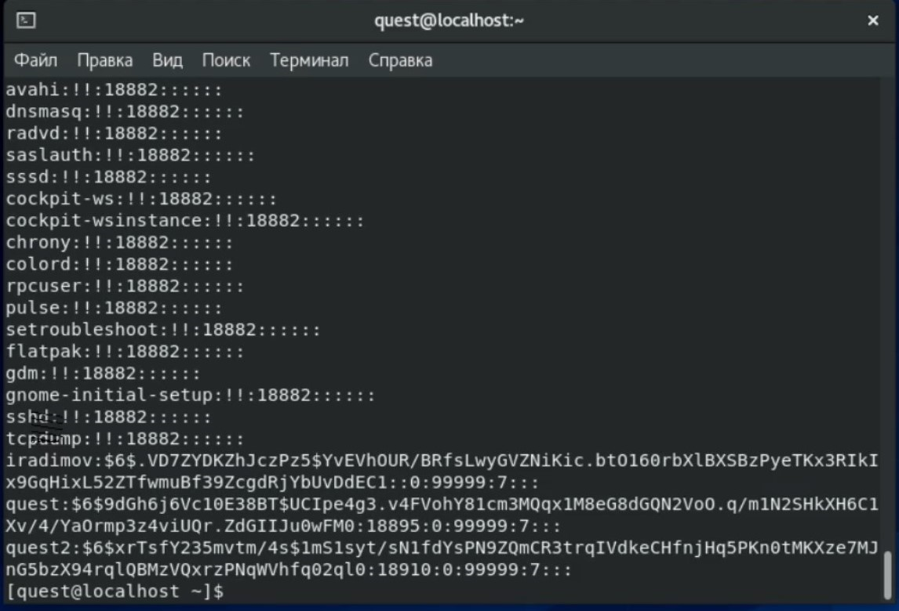{ #fig:008 width=60% }

---

## Исследование Sticky-бита

9. От пользователя quest2 (не являющегося владельцем) попробовал прочитать файл /tmp/file01.txt командой cat /tmp/file01.txt (рис. 9).

   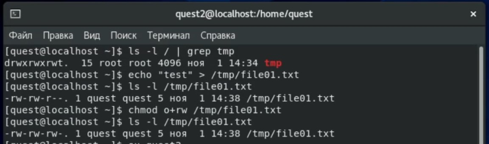{ #fig:009 width=60% }

---

10. От пользователя quest2 попробовал удалить файл /tmp/file01.txt командой rm /tmp/fileOl.txt. Мне не удалось удалить файл (рис. 10).

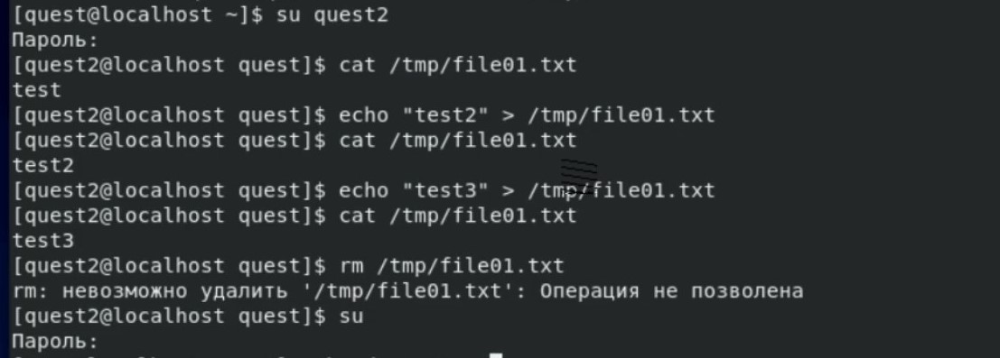{ #fig:010 width=60% }

---

11. Повторил предыдущие шаги (рис. 11). Видим, что дозапись и запись так же разрешены, но при этом удалось и удалить файл. Мне удалось удалить файл от имени пользователя, не являющегося его владельцем.

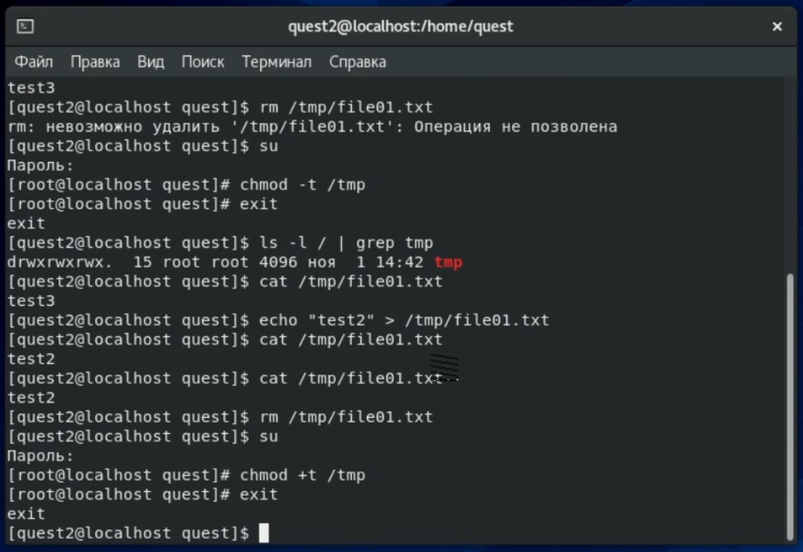{ #fig:011 width=60% }

---

## {.standout}

Спасибо за внимание
