---
# Front matter
lang: ru-RU
title: 'Отчёт по лабораторной работе 5'
subtitle: 'Дискреционное разграничение прав в Linux. Исследование влияния дополнительных атрибутов'
author: 'Радимов Игорь'

# Formatting
toc-title: 'Содержание'
toc: true # Table of contents
toc_depth: 2
lof: true # List of figures
lot: true # List of tables
fontsize: 12pt
linestretch: 1.5
papersize: a4paper
documentclass: scrreprt
polyglossia-lang: russian
polyglossia-otherlangs: english
mainfont: Ubuntu
romanfont: Ubuntu
sansfont: Ubuntu
monofont: Ubuntu
mainfontoptions: Ligatures=TeX
romanfontoptions: Ligatures=TeX
sansfontoptions: Ligatures=TeX,Scale=MatchLowercase
monofontoptions: Scale=MatchLowercase
indent: true
pdf-engine: lualatex
header-includes:
  - \linepenalty=10 # the penalty added to the badness of each line within a paragraph (no associated penalty node) Increasing the value makes tex try to have fewer lines in the paragraph.
  - \interlinepenalty=0 # value of the penalty (node) added after each line of a paragraph.
  - \hyphenpenalty=50 # the penalty for line breaking at an automatically inserted hyphen
  - \exhyphenpenalty=50 # the penalty for line breaking at an explicit hyphen
  - \binoppenalty=700 # the penalty for breaking a line at a binary operator
  - \relpenalty=500 # the penalty for breaking a line at a relation
  - \clubpenalty=150 # extra penalty for breaking after first line of a paragraph
  - \widowpenalty=150 # extra penalty for breaking before last line of a paragraph
  - \displaywidowpenalty=50 # extra penalty for breaking before last line before a display math
  - \brokenpenalty=100 # extra penalty for page breaking after a hyphenated line
  - \predisplaypenalty=10000 # penalty for breaking before a display
  - \postdisplaypenalty=0 # penalty for breaking after a display
  - \floatingpenalty = 20000 # penalty for splitting an insertion (can only be split footnote in standard LaTeX)
  - \raggedbottom # or \flushbottom
  - \usepackage{float} # keep figures where there are in the text
  - \floatplacement{figure}{H} # keep figures where there are in the text
---

# Цель работы

Изучение механизмов изменения идентификаторов, применения SetUID- и Sticky-битов. Получение практических навыков работы в консоли с дополнительными атрибутами. Рассмотрение работы механизма смены идентификатора процессов пользователей, а также влияние бита Sticky на запись и удаление файлов.

# Задание

Лабораторная работа подразумевает изучение влияния дополнительных атрибутов на файлы пользователя и изучение механизмов изменения идентификаторов.

# Теория

Биты SUID, SGID и Sticky
Unix отслеживает не символьные имена владельцев и групп, а их идентификаторы (UID - для пользователей и GID для групп). Эти идентификаторы хранятся в файлах /etc/passwd и /etc/group соответственно.
Установка битов SUID или SGID позволит пользователям запускать исполняемые файлы от имени владельца (или группы) запускаемого файла. Если мы установим SUID на исполняемый файл /bin/chmod, то обычный пользователь сможет использовать эту команду без использования sudo, так, что она будет выполнятся от имени пользователя root.
Каталог с установленным sticky-битом означает, что удалить файл из этого каталога может только владелец файла или суперпользователь. Другие пользователи лишаются права удалять файлы.

# Выполнение лабораторной работы

## Подготовка к выполнению

1. Установил компилятор gcc.

   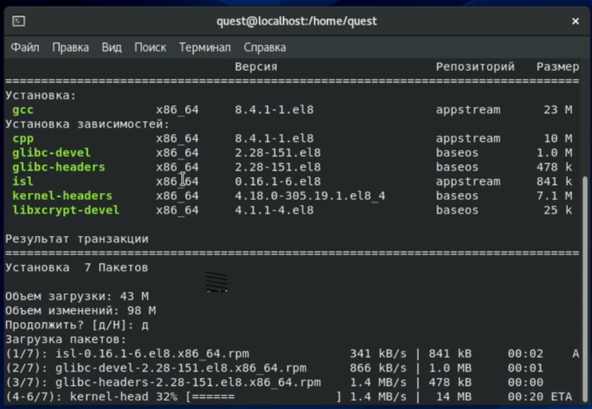{ #fig:001 width=60% }

## Выполнение основной частии лабораторной работы

1. Вошёл в систему от имени пользователя quest.

2. Создал программу simpleid.c (рис. 2).

   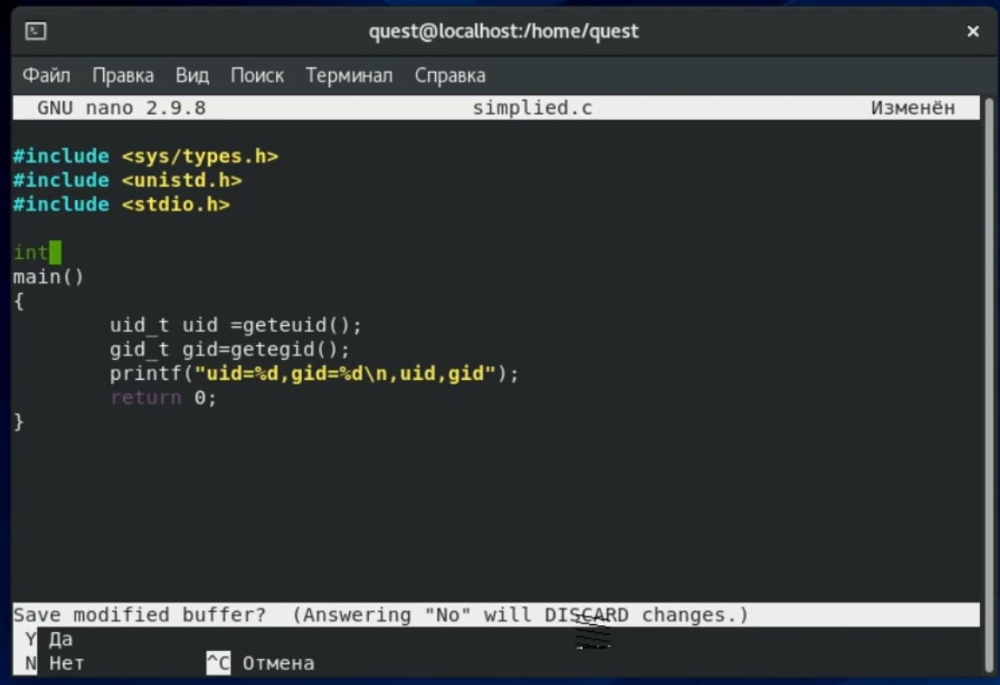{ #fig:002 width=60% }

3. Скомплилировал программу и убедился, что файл программы создан командой gcc simpleid.c -o simpleid (рис. 3).

4. Выполнил программу simpleid командой ./simpleid (рис. 3).

5. Выполнил системную программу id и сравнил полученный результат с данными предыдущего пункта задания (рис. 3). Видим, что пользователи и группы совпадают. При этом команда id вывела действительные идентификаторы, а программа вывел эффективные, но при этом они совпадают и выводят 1001, то есть пользователя quest.

   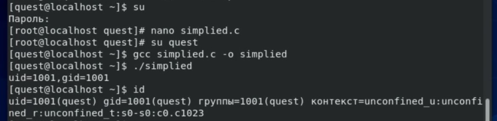{ #fig:003 width=60% }

6. Усложнил программу, добавив вывод действительных идентификаторов, получившуюся программу назвал simpleid2.c (рис. 4).

   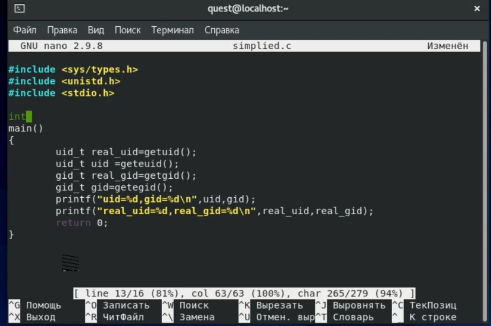{ #fig:004 width=60% }

7. Скомпилировал и запустил simpleid2.c командами gcc simpleid2.c -o simpleid2 и ./simpleid2 (рис. 5). Видим, что программа выводит эффективные и действительные идентификаторы пользователя и группы для файла. Видим, что везде это 1001, то есть пользователь quest.

   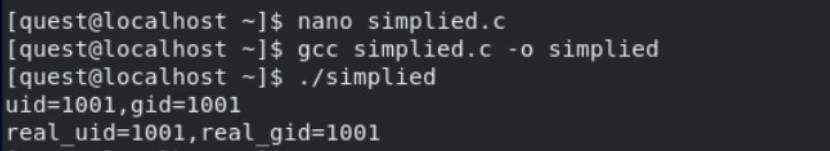{ #fig:005 width=60% }

8-9. От имени суперпользователя выполнил команды:chown root:quest /home/quest/simpleid2 и chmod u+s /home/quest/simpleid2. Временно поменяв свои права с помощью su (рис. 6).

С помощью этих команд файлу simpleid2 изменил владельца и группу на root и quest соответственно (chown), а также установил на файл SetUID-бит (chmod).

10. Выполнил проверку правильности установки новых атрибутов и смены владельца файла simpleid2 командой ls -l simpleid2 (рис. 6).

11. Запустил simpleid2 и id командами ./simpleid2 и id (рис. 6). Сравнил результаты: действительные идентификаторы совпадают с выводом команды id - везде 0, то есть рут-пользователь. Так же важно заметить, что эффективные идентификаторы совпадают с действительными.

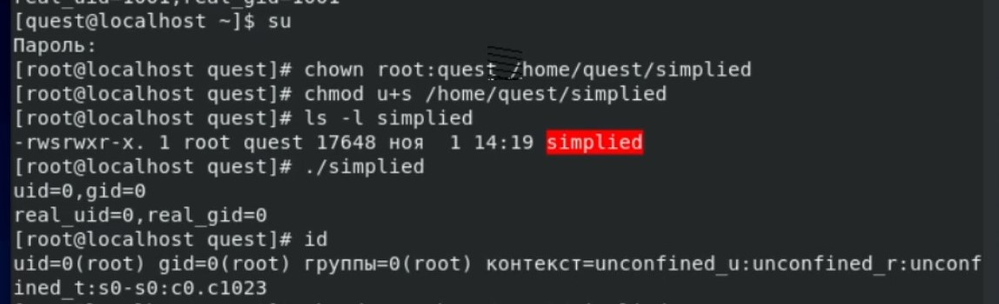{ #fig:006 width=60% }

12. Проделал тоже самое относительно SetGID-бита (рис. 7)

Установка SetGID-бита отражается к команде ls, а сравнение выполнения программы и команды id дало следующие результаты: действительные идентификаторы совпадают с выводом команды id - везде 0, то есть рут-пользователь. Но так же важно заметить, что эффективные идентификаторы отличны от действительных: пользователь - 0, группа - 1001.

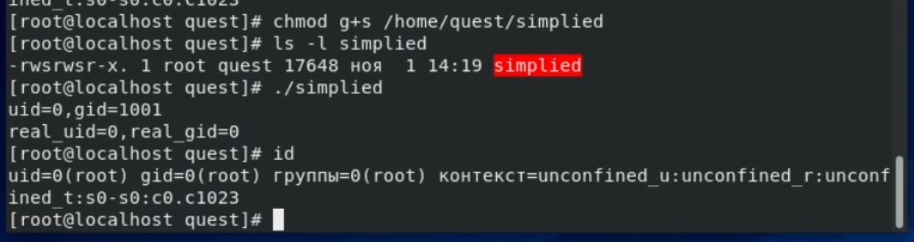{ #fig:007 width=60% }

13. Создал программу readfile.c (рис. 8).

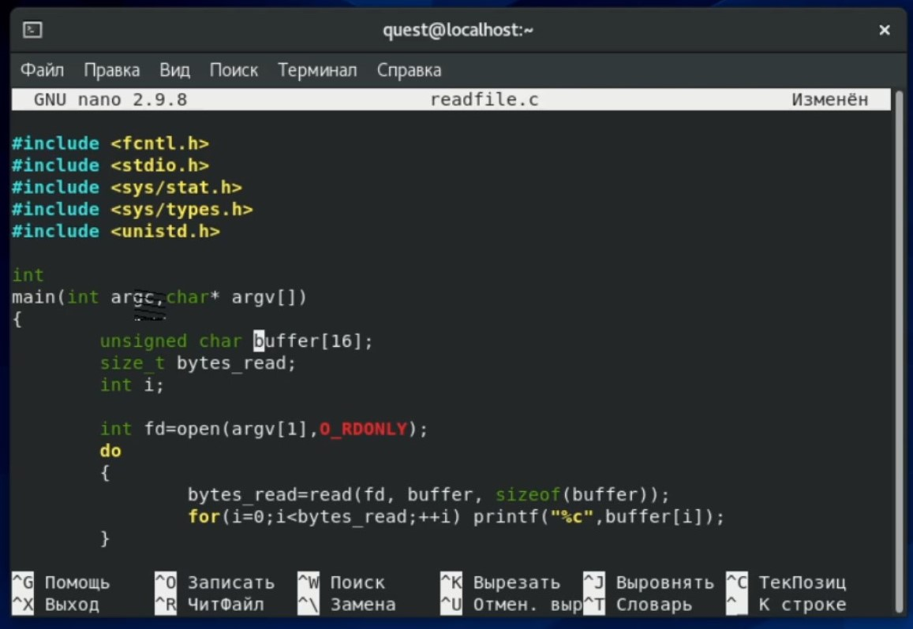{ #fig:008 width=60% }

14. Откомпилировал её командой gcc readfile.c -o readfile (рис. 9).

15. Сменил владельца у файла readfile.c (chown) и изменил права так, чтобы только суперпользователь (root) мог прочитать его, a quest не мог. Использовал chmod a-r (рис. 9).

16. Проверил, что пользователь quest не может прочитать файл readfile.c командой cat (рис. 9).

17. Сменил у программы readfile владельца и установил SetUID-бит (рис. 9).

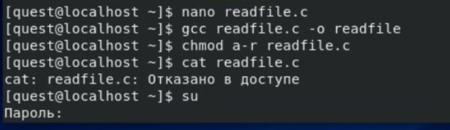{ #fig:009 width=60% }

18. Проверил, может ли программа readfile прочитать файл readfile.c. Да, может (рис. 10).

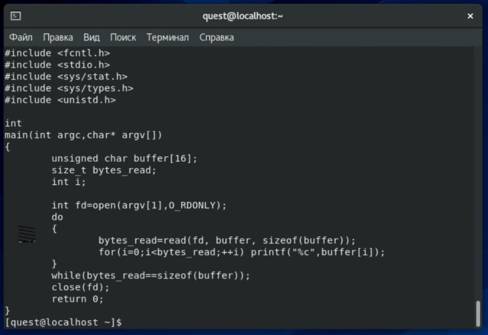{ #fig:010 width=60% }

19. Проверил, может ли программа readfile прочитать файл /etc/shadow. Её выполненеи возможно в том числе, так как владельцем файла является root-пользователь (рис. 11).

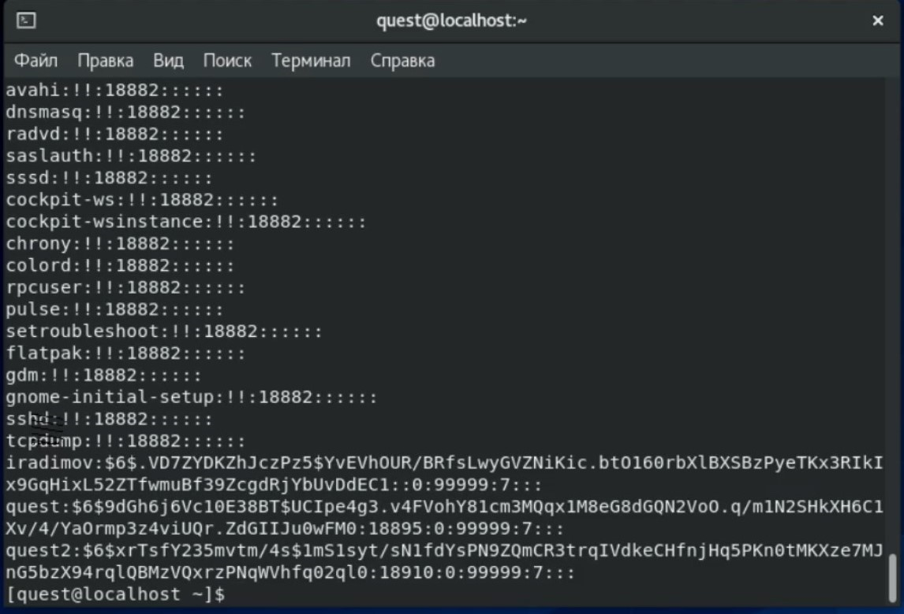{ #fig:011 width=60% }

## Исследование Sticky-бита

1. Выяснилв, установлен ли атрибут Sticky на директории /tmp, для чего выполнил команду ls -l / | grep tmp (рис. 12). Видим, что установлен, так как есть буква t.

2. От имени пользователя quest создал файл file01.txt в директории /tmp со словом test командой echo "test" > /tmp/file01.txt (рис. 12).

3. Просмотрел атрибуты у только что созданного файла и разрешил чтение и запись для категории пользователей «все остальные». Выполнил команды ls -l /tmp/file01.txt и chmod o+rw /tmp/file01.txt и ls -l /tmp/file01.txt (рис. 12).

4. От пользователя quest2 (не являющегося владельцем) попробовал прочитать файл /tmp/file01.txt командой cat /tmp/file01.txt (рис. 12).

   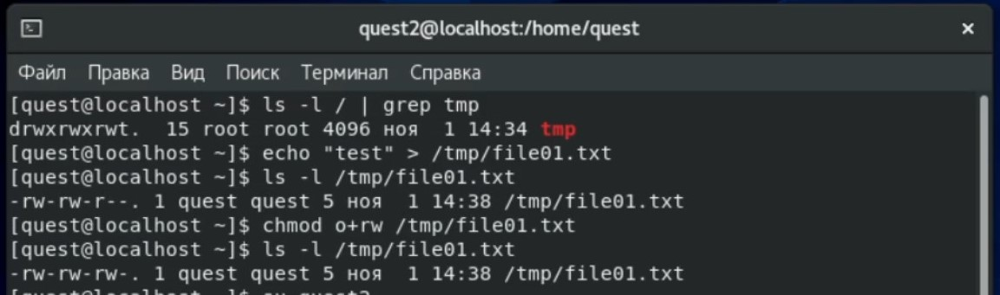{ #fig:012 width=60% }

5. От пользователя quest2 попробовал дозаписать в файл /tmp/file01.txt слово test2 командой echo "test2" >> /tmp/file01.txt. Мне удалось выполнить операцию (рис. 13).

6. Проверил содержимое файла командой cat /tmp/file01.txt (рис. 13).

7. От пользователя quest2 попробовал записать в файл /tmp/file01.txt слово test3, стерев при этом всю имеющуюся в файле информацию командой echo "test3" > /tmp/file01.txt. Мне удалось выполнить операцию (рис. 13).

8. Проверил содержимое файла командой cat /tmp/file01.txt (рис. 13).

9. От пользователя quest2 попробовал удалить файл /tmp/file01.txt командой rm /tmp/fileOl.txt. Мне нее удалось удалить файл (рис. 13).

   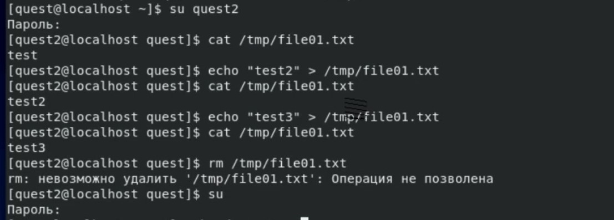{ #fig:013 width=60% }

Можем сделать вывод, что разрешена дозапись в файл, запись в файл, но мы не можем удалять файл из директории, на которую установлен атрибут Sticky.

10. Повысил свои права до суперпользователя следующей командой su - и выполнил после этого команду, снимающую атрибут t (Sticky-бит) с директории /tmp: chmod -t /tmp (рис. 14).

11. Покинул режим суперпользователя командой exit (рис. 14).

12. От пользователя quest2 проверил, что атрибута t у директории /tmp нет: ls -l / | grep tmp (рис. 14).

13. Повторил предыдущие шаги (рис. 14). Видим, что дозапись и запись так же разрешены, но при этом удалось и удалить файл.

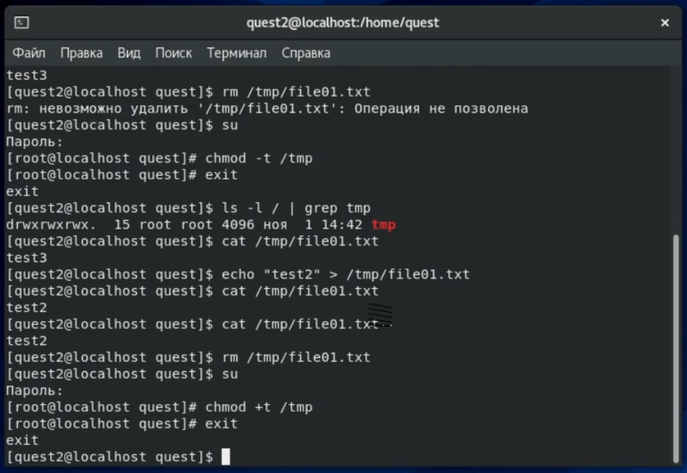{ #fig:014 width=60% }

14. Мне удалось удалить файл от имени пользователя, не являющегося его владельцем.

15. Повысил свои права до суперпользователя и верните атрибут t на директорию /tmp: su -, chmod +t /tmp, exit (рис. 15).

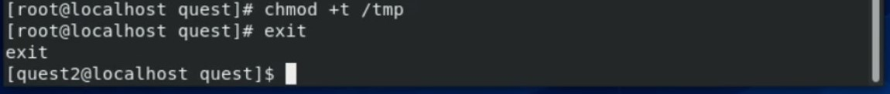{ #fig:015 width=60% }

# Библиография

1. ТУИС РУДН
2. https://help.ubuntu.ru/wiki/стандартные_права_unix

# Выводы

Я изучил механизмы изменения идентификаторов, применения SetUID- и Sticky-битов. Получил практические навыки работы в консоли с дополнительными атрибутами. Рассмотрел работу механизма смены идентификатора процессов пользователей, а также влияние бита Sticky на запись и удаление файлов.
