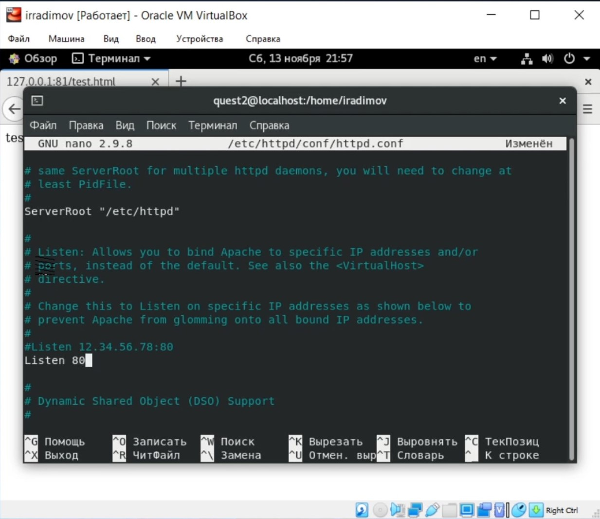
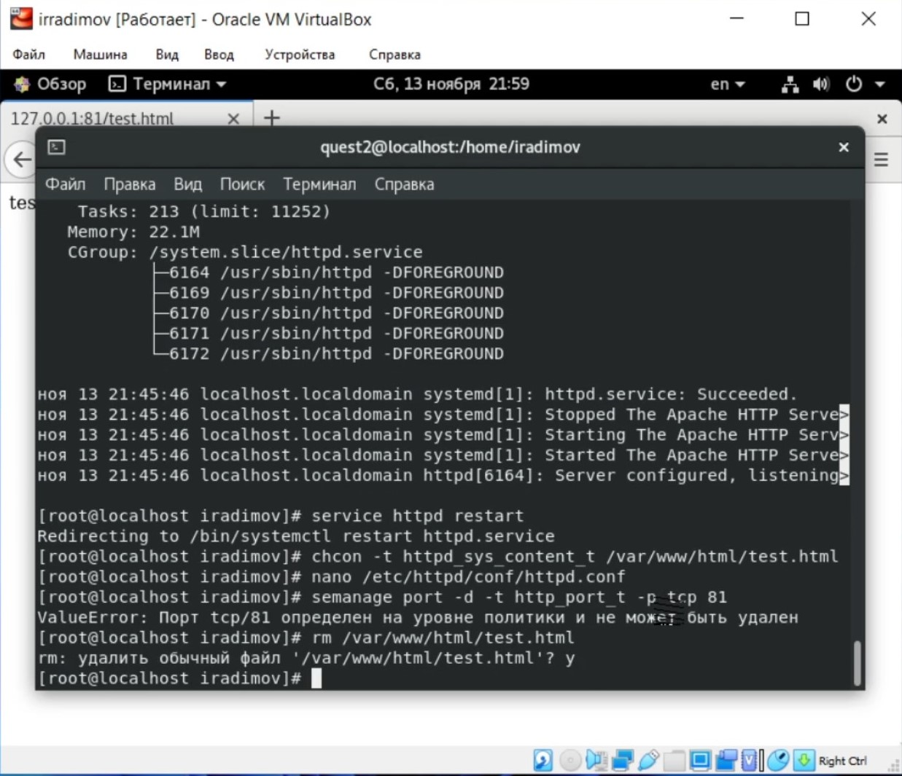

---
# Front matter
title: 'Отчёт по лабораторной работе 6'
author: 'Радимов Игорь'

# Generic otions
lang: ru-RU
toc-title: "Содержание"

# Pdf output format
toc: true # Table of contents
toc_depth: 2
lof: true # List of figures
lot: true # List of tables
fontsize: 12pt
linestretch: 1.5
papersize: a4
documentclass: scrreprt
## I18n
polyglossia-lang:
  name: russian
  options:
	- spelling=modern
	- babelshorthands=true
polyglossia-otherlangs:
  name: english
### Fonts
mainfont: Ubuntu
romanfont: Ubuntu
sansfont: Ubuntu
monofont: Ubuntu
mainfontoptions: Ligatures=TeX
romanfontoptions: Ligatures=TeX
sansfontoptions: Ligatures=TeX,Scale=MatchLowercase
monofontoptions: Scale=MatchLowercase,Scale=0.9
## Biblatex
biblatex: true
biblio-style: "gost-numeric"
biblatexoptions:
  - parentracker=true
  - backend=biber
  - hyperref=auto
  - language=auto
  - autolang=other*
  - citestyle=gost-numeric
## Misc options
indent: true
header-includes:
  - \linepenalty=10 # the penalty added to the badness of each line within a paragraph (no associated penalty node) Increasing the value makes tex try to have fewer lines in the paragraph.
  - \interlinepenalty=0 # value of the penalty (node) added after each line of a paragraph.
  - \hyphenpenalty=50 # the penalty for line breaking at an automatically inserted hyphen
  - \exhyphenpenalty=50 # the penalty for line breaking at an explicit hyphen
  - \binoppenalty=700 # the penalty for breaking a line at a binary operator
  - \relpenalty=500 # the penalty for breaking a line at a relation
  - \clubpenalty=150 # extra penalty for breaking after first line of a paragraph
  - \widowpenalty=150 # extra penalty for breaking before last line of a paragraph
  - \displaywidowpenalty=50 # extra penalty for breaking before last line before a display math
  - \brokenpenalty=100 # extra penalty for page breaking after a hyphenated line
  - \predisplaypenalty=10000 # penalty for breaking before a display
  - \postdisplaypenalty=0 # penalty for breaking after a display
  - \floatingpenalty = 20000 # penalty for splitting an insertion (can only be split footnote in standard LaTeX)
  - \raggedbottom # or \flushbottom
  - \usepackage{float} # keep figures where there are in the text
  - \floatplacement{figure}{H} # keep figures where there are in the text
---

# Цель работы

Развить навыки администрирования ОС Linux. Получить первое практическое знакомство с технологией SELinux.
Проверить работу SELinx на практике совместно с веб-сервером
Apache.

# Задание

Лабораторная работа подразумевает изучение влияния дополнительных атрибутов на файлы пользователя и изучение механизмов изменения идентификаторов.

# Подготовка

1. В конфигурационном файле /etc/httpd/conf/httpd.conf задал параметр ServerName: ServerName test.ru

{ #fig:001 width=90% }

2. Проследил, чтобы пакетный фильтр был отключён
   или в своей рабочей конфигурации позволял подключаться к 80-у и 81-у
   портам протокола tcp. Команды iptables -F и iptables -P INPUT ACCEPT iptables -P OUTPUT ACCEPT

{ #fig:002 width=90% }

# Выполнение лабораторной работы

1. Войдём в систему и убедимся что SELinux работает в режиме enforcing. Убедимся что веб-сервер работает. Найдём веб-сервер Apache в списке процессов. Посмотрим текущее состояние переключателей SELinux для Apache.(рис 3-6)

{ #fig:003 width=90% }

{ #fig:004 width=90% }

{ #fig:005 width=90% }

{ #fig:006 width=90% }

2. Посмотрим статистику по политике. Определим тип файлов и поддиректорий в /var/www и /var/www/html. Определим круг пользователей, которым разрешено создание файлов в директории /var/www/html. Создадим от имени суперпользователя html файл. Проверим контенкст созданного файла. (рис.7-10)

{ #fig:007 width=90% }

{ #fig:008 width=90% }

{ #fig:009 width=90% }

{ #fig:010 width=90% }

3. Обратимся к файлу через веб-сервер и убедимся, что файл был успешно отображен. Выясним какие контексты файлов определены для httpd. Изменим контекст файла test.html . Попробуем ещё раз получить доступ к файлу через веб-серввер, но получим сообщение об ошибке.(рис.11-15)

{ #fig:011 width=90% }

{ #fig:012 width=90% }

{ #fig:013 width=90% }

{ #fig:014 width=90% }

{ #fig:015 width=90% }

4. Посмотрим лог файлы веб-сервера Apache. Попробуем запустить веб-сервер Apache на прослушивание TCP-порта 81. Выполним перезапуск(получен сбой). ( рис.16-19)

{ #fig:016 width=90% }

{ #fig:017 width=90% }

{ #fig:018 width=90% }

{ #fig:019 width=90% }

5. Проанализируем лог файлы. Проверим список портов и убедимся, что 81 появился в списке. Попробуем запустить сервер ещё раз. Успешно.(рис. 20-24)

{ #fig:020 width=90% }

{ #fig:021 width=90% }

{ #fig:022 width=90% }

{ #fig:023 width=90% }

{ #fig:024 width=90% }

6. Исправим обратно конфигурационный файл apache. Удалим привязку к 81 порту. Удалим файл test.html.(рис. 25-26)

{ #fig:025 width=90% }

{ #fig:026 width=90% }

# Библиография

1. ТУИС РУДН

# Выводы

Развил навыки администрирования ОС Linux. Получил первое практическое знакомство с технологией SELinux1.
Проверил работу SELinx на практике совместно с веб-сервером
Apache.
