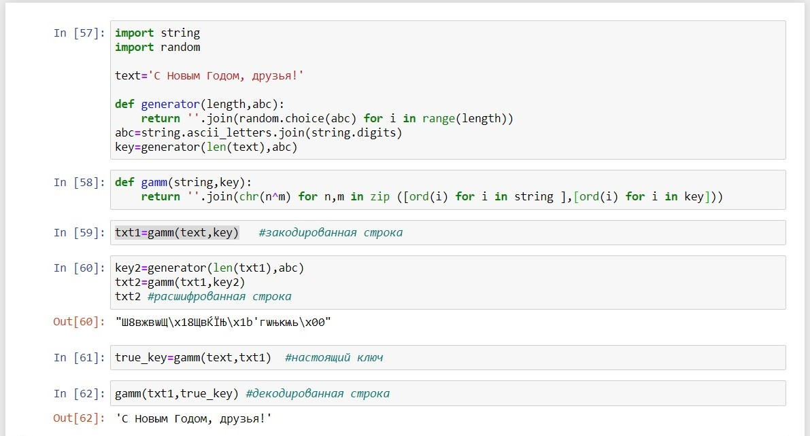

---
# Front matter
title: "Отчет по лабораторной работе 7"
author: "Радимов Игорь"

# Generic otions
lang: ru-RU
toc-title: "Содержание"

# Pdf output format
toc: true # Table of contents
toc_depth: 2
lof: true # List of figures
lot: true # List of tables
fontsize: 12pt
linestretch: 1.5
papersize: a4
documentclass: scrreprt
## I18n
polyglossia-lang:
  name: russian
  options:
	- spelling=modern
	- babelshorthands=true
polyglossia-otherlangs:
  name: english
### Fonts
mainfont: Ubuntu
romanfont: Ubuntu
sansfont: Ubuntu
monofont: Ubuntu
mainfontoptions: Ligatures=TeX
romanfontoptions: Ligatures=TeX
sansfontoptions: Ligatures=TeX,Scale=MatchLowercase
monofontoptions: Scale=MatchLowercase,Scale=0.9
## Biblatex
biblatex: true
biblio-style: "gost-numeric"
biblatexoptions:
  - parentracker=true
  - backend=biber
  - hyperref=auto
  - language=auto
  - autolang=other*
  - citestyle=gost-numeric
## Misc options
indent: true
header-includes:
  - \linepenalty=10 # the penalty added to the badness of each line within a paragraph (no associated penalty node) Increasing the value makes tex try to have fewer lines in the paragraph.
  - \interlinepenalty=0 # value of the penalty (node) added after each line of a paragraph.
  - \hyphenpenalty=50 # the penalty for line breaking at an automatically inserted hyphen
  - \exhyphenpenalty=50 # the penalty for line breaking at an explicit hyphen
  - \binoppenalty=700 # the penalty for breaking a line at a binary operator
  - \relpenalty=500 # the penalty for breaking a line at a relation
  - \clubpenalty=150 # extra penalty for breaking after first line of a paragraph
  - \widowpenalty=150 # extra penalty for breaking before last line of a paragraph
  - \displaywidowpenalty=50 # extra penalty for breaking before last line before a display math
  - \brokenpenalty=100 # extra penalty for page breaking after a hyphenated line
  - \predisplaypenalty=10000 # penalty for breaking before a display
  - \postdisplaypenalty=0 # penalty for breaking after a display
  - \floatingpenalty = 20000 # penalty for splitting an insertion (can only be split footnote in standard LaTeX)
  - \raggedbottom # or \flushbottom
  - \usepackage{float} # keep figures where there are in the text
  - \floatplacement{figure}{H} # keep figures where there are in the text
---

# Цель работы

Освоить на практике применение режима однократного гаммирования.

# Задание

Лабораторная работа подразумевает использование языков программирования для создания программы для щифрования и дещифрования в режиме однократного гаммирования.

# Теория

Гаммирование, или Шифр XOR, — метод симметричного шифрования, заключающийся в «наложении» последовательности, состоящей из случайных чисел, на открытый текст. Последовательность случайных чисел называется гамма-последовательностью и используется для зашифровывания и расшифровывания данных.

# Выполнение работы

1. Разработаем приложение, позволяющее шифровать и дешифровать данные в режиме однократного гаммирования.(рис 1)

{ #fig:001 width=90% }

# Контрольные вопросы

1. Поясните смысл однократного гаммирования.

Гаммирование – это наложение (снятие) на открытые (зашифрованные) данные криптографической гаммы, то есть последовательности элементов данных, вырабатываемых с помощью некоторого криптографического алгоритма, для получения зашифрованных (открытых) данных.

Однократное гаммирование – это когда каждый символ попарно с символом ключа складываются по модулю 2 (XOR).

2. Перечислите недостатки однократного гаммирования.

Размер ключевого материала должен совпадать с размером передаваемых сообщений. Также необходимо иметь эффективные процедуры для выработки случайных равновероятных двоичных последовательностей и специальную службу для развоза огромного количества ключей. А ещё, если одну и ту же гамму использовать дважды для разных сообщений, то шифр из совершенно стойкого превращается в «совершенно нестойкий» и допускает дешифрование практически вручную.

3. Перечислите преимущества однократного гаммирования.

С точки зрения теории криптоанализа метод шифрования случайной однократной равновероятной гаммой той же длины, что и открытый текст, является невскрываемым. Кроме того, даже раскрыв часть сообщения, дешифровщик не сможет хоть сколько-нибудь поправить положение - информация о вскрытом участке гаммы не дает информации об остальных ее частях. К достоинствам также можно отнести простоту реализации и удобство применения.

4. Почему длина открытого текста должна совпадать с длиной ключа?

Потому что каждый символ открытого текста должен складываться с символом ключа попарно.

5. Какая операция используется в режиме однократного гаммирования, назовите её особенности?

В режиме однократного гаммирования используется сложение по модулю 2 (XOR) между элементами гаммы и элементами подлежащего сокрытию текста. Особенность заключается в том, что этот алгоритм шифрования является симметричным. Поскольку двойное прибавление одной и той же величины по модулю 2 восстанавливает исходное значение, шифрование и расшифрование выполняется одной и той же программой.

# Библиография

1. ТУИС РУДН

# Выводы

Во время выполнения лабораторной работы я освоил на практике применение режима однократного гаммирования.
