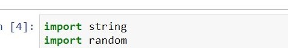
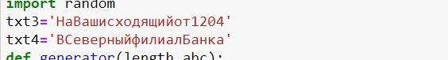
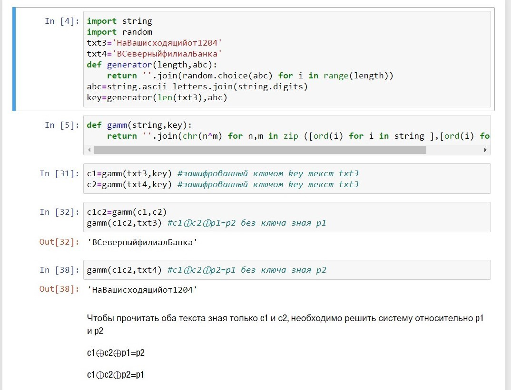

---
## Front matter
lang: ru-RU
title: Отчёт по лабораторной работе 8
author: 'Радимов Игорь'
date: 18 декабря, 2021

## Formatting
toc: false
slide_level: 2
theme: metropolis
mainfont: Ubuntu
romanfont: Ubuntu
sansfont: Ubuntu
monofont: Ubuntu
header-includes:
  - \metroset{progressbar=frametitle,sectionpage=progressbar,numbering=fraction}
  - '\makeatletter'
  - '\beamer@ignorenonframefalse'
  - '\makeatother'
aspectratio: 43
section-titles: true
---

## Цель работы

Освоить на практике применение режима однократного гаммирования на примере кодирования различных исходных текстов одним ключом.

## Задание

Лабораторная работа подразумевает использование языков программирования для создания программы для щифрования и дещифрования в режиме однократного гаммирования при известном ключе.

# Выполнение лабораторной работы

1. Импортируем библиотеки random,string..

{ #fig:001 width=70% }

---

2. Зададим строковые переменные.

{ #fig:002 width=70% }

---

3. Зададим функции гаммирования, и дешифрования.

{ #fig:003 width=70% }

---

4. Расшифруем каждую строку зная другую.

{ #fig:004 width=70% }

---

## {.standout}

Спасибо за внимание
